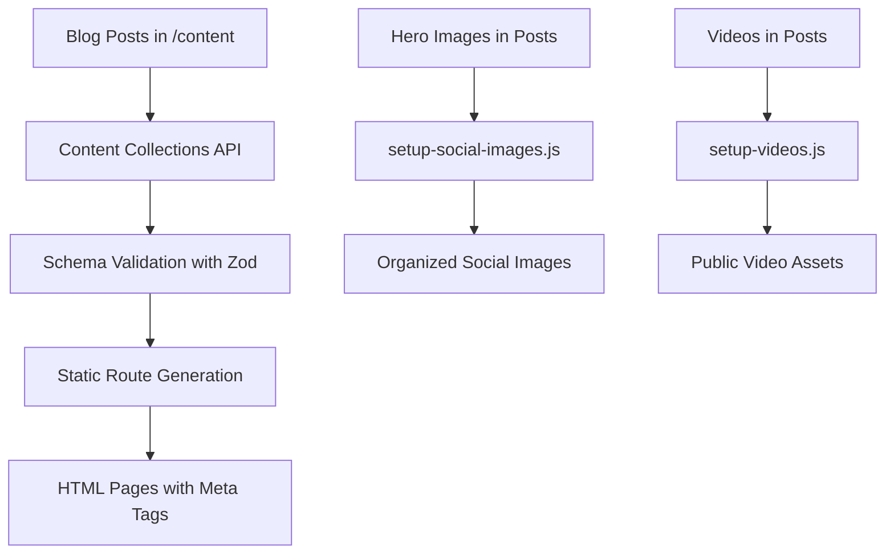
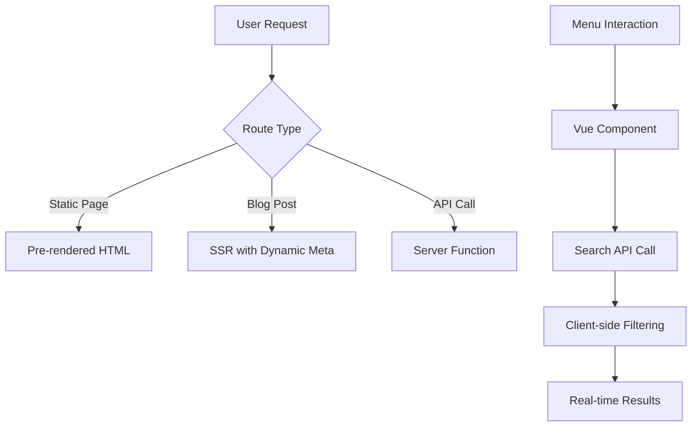

# Technical Architecture

HashBlog implements a modern web architecture that combines static site generation with selective interactivity, optimized for performance, SEO, and developer experience.

## 🏗 Architecture Overview

```
┌─────────────────────────────────────────────────────────────┐
│                     Cloudflare Edge Network                 │
├─────────────────────────────────────────────────────────────┤
│  ┌─────────────────┐  ┌──────────────────┐  ┌─────────────┐ │
│  │  Static Assets  │  │   Server Routes  │  │  Functions  │ │
│  │  (Images, CSS)  │  │  (API, Search)   │  │   (SSR)     │ │
│  └─────────────────┘  └──────────────────┘  └─────────────┘ │
└─────────────────────────────────────────────────────────────┘
                             │
                             ▼
┌─────────────────────────────────────────────────────────────┐
│                        Astro 5.8.1                         │
│  ┌─────────────────┐  ┌──────────────────┐  ┌─────────────┐ │
│  │  Static Pages   │  │   Vue Islands    │  │    API      │ │
│  │  (Blog Posts)   │  │    (Menu)        │  │  (Search)   │ │
│  └─────────────────┘  └──────────────────┘  └─────────────┘ │
└─────────────────────────────────────────────────────────────┘
                             │
                             ▼
┌─────────────────────────────────────────────────────────────┐
│                      Content Layer                         │
│  ┌─────────────────┐  ┌──────────────────┐  ┌─────────────┐ │
│  │   MDX Content   │  │   Type Schema    │  │   Assets    │ │
│  │  (Blog Posts)   │  │    (Zod)         │  │ (Images/Video)│ │
│  └─────────────────┘  └──────────────────┘  └─────────────┘ │
└─────────────────────────────────────────────────────────────┘
```

## 🔧 Core Technologies

### Frontend Framework: Astro 5.8.1
- **Islands Architecture**: Selective hydration for optimal performance
- **Static Generation**: Most content pre-rendered at build time
- **Server-Side Rendering**: Dynamic routes for blog posts
- **Built-in Optimizations**: Image processing, CSS minification, bundling

**Key Benefits**:
- Zero JavaScript by default (only hydrates interactive components)
- Excellent SEO with server-side rendering
- Framework agnostic (supports Vue, React, Svelte)
- Built-in performance optimizations

### Interactive Components: Vue 3.5.16
- **Composition API**: Modern reactive programming model
- **TypeScript Integration**: Full type safety
- **Single Component**: Menu with integrated search functionality
- **Islands Hydration**: Loaded with `client:load` directive

**Component Usage**:
```astro
<!-- Only the Menu component uses Vue -->
<Menu client:load />
```

### Styling: Tailwind CSS + Custom Design System
- **Utility-First**: Minimal custom CSS with Tailwind utilities
- **Custom Design Tokens**: Colors, typography, and spacing
- **Dark Theme**: Consistent dark mode throughout
- **Responsive Design**: Mobile-first approach

### Content Management: MDX + Content Collections
- **MDX**: Rich content with component embedding
- **Type Safety**: Zod schema validation for frontmatter
- **Asset Management**: Organized image and video handling
- **Draft System**: Content preview before publication

## 📁 Directory Structure Deep Dive

### Source Code (`/src`)

```
src/
├── components/           # Reusable UI components
│   ├── Layout.astro     # Base page layout with SEO
│   ├── Header.astro     # Site header with menu button
│   ├── Menu.vue         # Interactive full-screen menu (Vue)
│   ├── BlogCard.astro   # Blog post card component
│   ├── Navigation.astro # Previous/next post navigation
│   └── Share.astro      # Social sharing buttons
├── content/             # Content collections
│   ├── config.ts        # Content schema with Zod validation
│   └── blog/            # Blog posts in date-prefixed directories
├── layouts/             # Page layout templates
│   └── Layout.astro     # Main layout wrapper
├── pages/               # Route definitions and API endpoints
│   ├── index.astro      # Homepage
│   ├── about.astro      # About page
│   ├── [year]/[month]/[slug].astro  # Dynamic blog routes
│   ├── api/search.json.ts           # Search API endpoint
│   ├── rss.xml.ts                   # RSS feed generation
│   └── sitemap.xml.ts               # XML sitemap
├── styles/              # Global styles and Tailwind
│   └── global.css       # Custom CSS layers
└── utils/               # Utility functions
    └── url.ts           # URL generation utilities
```

### Content Architecture

```
src/content/blog/YYYY-MM-DD-post-title/
├── index.mdx            # Post content with frontmatter
├── images/              # Post-specific images
│   ├── hero.jpg        # Social sharing image
│   └── screenshots/    # Additional images
└── videos/             # Optional local videos
    └── demo.mp4        # Video content
```

### Static Assets (`/public`)

```
public/
├── images/              # Site-wide images
│   ├── logo.png        # Site logo
│   └── og-default.png  # Default Open Graph image
├── social-images/       # Organized hero images (build-generated)
│   └── YYYY/
│       └── post-slug/
│           └── hero.ext
├── videos/              # Public video files (build-generated)
│   └── YYYY-MM-DD-post-slug/
│       └── video.mp4
└── favicon.ico          # Site favicon
```

## 🔄 Data Flow

### 1. Build-Time Data Flow



### 2. Runtime Data Flow



## 🎨 Component Architecture

### Astro Components (Server-Rendered)

**Layout.astro** - Base layout with comprehensive SEO:
```typescript
interface Props {
  title?: string;
  description?: string;
  heroImage?: string;
  article?: boolean;
  pubDate?: string;
  tags?: string[];
}
```

**Header.astro** - Site navigation:
- Logo display with proper alt text
- Menu toggle button with hamburger icon
- Responsive design with backdrop blur

**BlogCard.astro** - Reusable post cards:
- Featured post styling with gradients
- Standard post grid layout
- Automatic date formatting and tag display

### Vue Components (Client-Hydrated)

**Menu.vue** - Interactive full-screen menu:
```typescript
// Reactive state
const isOpen = ref(false);
const searchQuery = ref("");
const searchResults = ref<Post[]>([]);

// Methods
async function loadPosts()
function performSearch()
function formatDate(date: string | Date)
```

**Key Features**:
- Real-time search across title, description, tags, and content
- Smooth animations with staggered reveals
- Keyboard navigation (Escape key)
- Body scroll locking during menu display

## 🔍 Search Implementation

### Architecture Overview


### API Endpoint (`/api/search.json.ts`)

```typescript
export async function GET() {
  const posts = await getCollection('blog', ({ data }) => {
    return !data.draft;
  });

  const processedPosts = posts
    .map(post => ({
      slug: post.slug,
      data: post.data,
      body: post.body
    }))
    .sort((a, b) => b.data.pubDate.valueOf() - a.data.pubDate.valueOf());

  return new Response(JSON.stringify({ posts: processedPosts }), {
    headers: {
      'Content-Type': 'application/json',
      'Cache-Control': 'max-age=3600'
    }
  });
}
```

### Client-Side Search Logic

```typescript
function performSearch() {
  if (!searchQuery.value.trim()) {
    searchResults.value = [];
    return;
  }

  const query = searchQuery.value.toLowerCase();
  const filtered = allPosts.value.filter(post => {
    const { title, description, tags = [] } = post.data;
    const { body = '' } = post;

    return (
      title.toLowerCase().includes(query) ||
      description.toLowerCase().includes(query) ||
      tags.some(tag => tag.toLowerCase().includes(query)) ||
      body.toLowerCase().includes(query)
    );
  });

  searchResults.value = filtered.slice(0, 10);
}
```

## 🛠 Build Process

### Multi-Stage Build Pipeline

```bash
npm run build = setup-social-images + setup-videos + astro build
```

### 1. Asset Organization Phase

**Social Images Script** (`/scripts/setup-social-images.js`):
```javascript
// Extract hero images from blog post frontmatter
// Organize in /public/social-images/year/slug/hero.ext
// Enable proper Open Graph meta tags
```

**Video Setup Script** (`/scripts/setup-videos.js`):
```javascript
// Copy videos from post directories
// Place in /public/videos/YYYY-MM-DD-post-slug/
// Support multiple video formats
```

### 2. Astro Build Phase

- **Static Generation**: Pre-render all blog posts and static pages
- **Asset Optimization**: Compress images, minify CSS/JS
- **Route Generation**: Create dynamic routes for `/YYYY/MM/slug` pattern
- **API Endpoints**: Build server functions for search and feeds

### 3. Optimization Features

- **Image Processing**: Automatic format conversion and resizing
- **CSS Optimization**: Tailwind purging and minification
- **JavaScript Bundling**: Code splitting and tree shaking
- **HTML Compression**: Minified output with gzip compression

## 🔗 Integration Points

### Cloudflare Pages Integration

```javascript
// astro.config.mjs
export default defineConfig({
  output: 'server',
  adapter: cloudflare({
    imageService: 'compile'
  }),
  site: 'https://hashir.blog'
});
```

**Key Features**:
- Server-side rendering for dynamic content
- Static asset optimization
- Edge function deployment
- Global CDN distribution

### GitHub Actions CI/CD

```yaml
# .github/workflows/deploy.yml
- uses: actions/setup-node@v3
  with:
    node-version: 18
    cache: 'npm'

- run: npm ci
- run: npm run build

- uses: cloudflare/pages-action@v1
  with:
    apiToken: ${{ secrets.CLOUDFLARE_API_TOKEN }}
    accountId: ${{ secrets.CLOUDFLARE_ACCOUNT_ID }}
```

## 📊 Performance Architecture

### Bundle Analysis

- **HTML**: Pre-rendered static pages (< 50KB per page)
- **CSS**: Tailwind CSS purged to essential styles (< 20KB)
- **JavaScript**: Minimal Vue runtime for menu only (< 50KB)
- **Images**: Optimized with proper formats and lazy loading

### Caching Strategy

- **Static Assets**: Long-term caching with fingerprinted filenames
- **API Responses**: 1-hour cache for search endpoint
- **CDN Caching**: Cloudflare edge caching for global performance
- **Browser Caching**: Optimized cache headers for repeat visits

### Loading Strategy

- **Critical CSS**: Inlined for above-the-fold content
- **Progressive Enhancement**: Core content loads without JavaScript
- **Lazy Loading**: Images and non-critical resources loaded on demand
- **Prefetching**: Viewport-based prefetching for navigation

## 🔒 Security Considerations

### Content Security
- **Input Validation**: Zod schema validation for all content
- **XSS Prevention**: Proper escaping in templates
- **External Links**: Automatic `rel="noopener noreferrer"` attributes

### Build Security
- **Dependency Scanning**: Regular updates and security audits
- **Environment Isolation**: Build-time vs runtime environment separation
- **Asset Integrity**: Fingerprinted assets prevent tampering

---

This architecture provides a solid foundation for a high-performance, maintainable blog platform that scales efficiently and provides excellent developer experience.