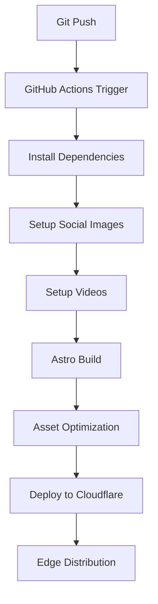

# Deployment & Production

HashBlog is designed for modern deployment workflows with automated builds, edge distribution, and comprehensive performance optimization. This guide covers the complete deployment process and production considerations.

## 📚 Table of Contents

- **[Performance](performance.md)** - Optimization strategies and monitoring
- **[SEO & Social](seo.md)** - Search engine and social media optimization
- **[Monitoring](monitoring.md)** - Analytics and performance tracking
- **[Security](security.md)** - Production security considerations

## 🚀 Deployment Overview

### Architecture

```
┌─────────────────────────────────────────────────────────────┐
│                 Cloudflare Global Network                  │
│  ┌─────────────────┐  ┌──────────────────┐  ┌─────────────┐ │
│  │   Static Site   │  │  Edge Functions  │  │     CDN     │ │
│  │   (Pre-built)   │  │   (API Routes)   │  │  (Assets)   │ │
│  └─────────────────┘  └──────────────────┘  └─────────────┘ │
└─────────────────────────────────────────────────────────────┘
                             │
                             ▼
┌─────────────────────────────────────────────────────────────┐
│                     GitHub Actions                         │
│  ┌─────────────────┐  ┌──────────────────┐  ┌─────────────┐ │
│  │   Build Stage   │  │   Test Stage     │  │   Deploy    │ │
│  │   (Asset Org)   │  │   (Validation)   │  │  (CF Pages) │ │
│  └─────────────────┘  └──────────────────┘  └─────────────┘ │
└─────────────────────────────────────────────────────────────┘
```

### Technology Stack

- **Platform**: Cloudflare Pages
- **CDN**: Cloudflare Global Network (300+ locations)
- **CI/CD**: GitHub Actions
- **Build Tool**: Astro with Cloudflare adapter
- **Assets**: Automated organization and optimization

## ⚙️ Configuration

### Cloudflare Pages Setup

**Project Configuration** (`wrangler.toml`):
```toml
name = "hashblog"
compatibility_date = "2024-01-01"
pages_build_output_dir = "dist"

[env.production]
name = "hashblog"

[env.preview]
name = "hashblog-preview"
```

**Astro Configuration** (`astro.config.mjs`):
```javascript
export default defineConfig({
  output: 'server',
  adapter: cloudflare({
    imageService: 'compile',
    platformProxy: {
      enabled: true
    }
  }),
  site: 'https://hashir.blog',
  integrations: [
    vue(),
    tailwind({ applyBaseStyles: false }),
    mdx()
  ]
});
```

### Environment Variables

**Required Secrets** (GitHub Repository Settings):
```bash
CLOUDFLARE_API_TOKEN=your_api_token
CLOUDFLARE_ACCOUNT_ID=your_account_id
```

**Optional Environment Variables**:
```bash
NODE_ENV=production
ASTRO_TELEMETRY_DISABLED=1  # Disable Astro telemetry
```

## 🔄 Build Process

### Multi-Stage Build Pipeline



### 1. Asset Organization Phase

**Social Images Script**:
```bash
npm run setup-social-images
# Extracts hero images from blog post frontmatter
# Organizes in /public/social-images/year/slug/hero.ext
# Enables proper Open Graph meta tags
```

**Video Setup Script**:
```bash
npm run setup-videos
# Copies videos from post directories
# Places in /public/videos/YYYY-MM-DD-post-slug/
# Supports multiple video formats (.mp4, .webm, .mov, .avi)
```

### 2. Build Optimization

**Astro Build Process**:
- **Static Generation**: Pre-render all blog posts and pages
- **Asset Fingerprinting**: Hash-based filenames for cache busting
- **Image Optimization**: Automatic format conversion and compression
- **CSS Optimization**: Tailwind purging and minification
- **JavaScript Bundling**: Code splitting and tree shaking

**Performance Optimizations**:
```javascript
// astro.config.mjs optimizations
export default defineConfig({
  vite: {
    build: {
      cssMinify: 'esbuild',
      rollupOptions: {
        output: {
          assetFileNames: 'assets/[name].[hash].[ext]',
          chunkFileNames: 'assets/[name].[hash].js',
          entryFileNames: 'assets/[name].[hash].js'
        }
      }
    }
  },
  compressHTML: true,
  prefetch: {
    prefetchAll: true,
    defaultStrategy: 'viewport'
  }
});
```

### 3. Deployment

**Deployment Method**: Currently uses Cloudflare Pages direct deployment

**Optional GitHub Actions Workflow** (`.github/workflows/deploy.yml`):
```yaml
name: Deploy to Cloudflare Pages
on:
  push:
    branches: [main]
  pull_request:
    branches: [main]

jobs:
  deploy:
    runs-on: ubuntu-latest
    permissions:
      contents: read
      deployments: write
    
    steps:
      - name: Checkout
        uses: actions/checkout@v4
      
      - name: Setup Node.js
        uses: actions/setup-node@v4
        with:
          node-version: 20
          cache: 'npm'
      
      - name: Install dependencies
        run: npm ci
      
      - name: Build project
        run: npm run build
      
      - name: Deploy to Cloudflare Pages
        uses: cloudflare/pages-action@v1
        with:
          apiToken: ${{ secrets.CLOUDFLARE_API_TOKEN }}
          accountId: ${{ secrets.CLOUDFLARE_ACCOUNT_ID }}
          projectName: hashblog
          directory: dist
          gitHubToken: ${{ secrets.GITHUB_TOKEN }}
          wranglerVersion: '3'
```

## 🌐 Domain and DNS

### Custom Domain Setup

**Domain Configuration**:
- **Primary**: `hashir.blog`
- **Alternative**: `hashblog.pages.dev` (Cloudflare default)
- **SSL**: Automatic Let's Encrypt certificates
- **HSTS**: HTTP Strict Transport Security enabled

**DNS Records** (Cloudflare DNS):
```
Type    Name    Content                 Proxy
CNAME   @       hashblog.pages.dev      ✅ Proxied
CNAME   www     hashblog.pages.dev      ✅ Proxied
```

### Redirects and Routing

**Automatic Redirects**:
- `www.hashir.blog` → `hashir.blog`
- HTTP → HTTPS (automatic)
- Legacy URLs → New structure (if applicable)

**Page Rules**:
```
URL Pattern: *hashir.blog/*
Settings:
- Always Use HTTPS: On
- Browser Cache TTL: 4 hours
- Cache Level: Standard
```

## 📊 Performance Optimization

### Caching Strategy

**Edge Caching** (Cloudflare):
- **Static Assets**: 1 year cache with immutable headers
- **HTML Pages**: 4 hours with revalidation
- **API Endpoints**: 1 hour cache with stale-while-revalidate
- **Images**: 30 days with aggressive compression

**Browser Caching**:
```javascript
// astro.config.mjs
export default defineConfig({
  vite: {
    build: {
      rollupOptions: {
        output: {
          // Hash-based filenames enable long-term caching
          assetFileNames: 'assets/[name].[hash].[ext]'
        }
      }
    }
  }
});
```

### Asset Optimization

**Image Optimization**:
- **WebP Conversion**: Automatic format optimization
- **Responsive Images**: Multiple sizes for different devices
- **Lazy Loading**: Viewport-based image loading
- **Social Images**: 1200x630px for optimal sharing

**CSS Optimization**:
- **Tailwind Purging**: Remove unused CSS classes
- **Critical CSS**: Inline above-the-fold styles
- **Minification**: Compressed CSS output
- **Font Optimization**: Preload and optimize web fonts

**JavaScript Optimization**:
- **Code Splitting**: Separate bundles for different routes
- **Tree Shaking**: Remove unused code
- **Minification**: Compressed JavaScript output
- **Selective Hydration**: Vue components only where needed

### Performance Metrics

**Target Scores** (Lighthouse):
- Performance: 90+
- Accessibility: 95+
- Best Practices: 95+
- SEO: 95+

**Core Web Vitals**:
- **First Contentful Paint**: < 1.5s
- **Largest Contentful Paint**: < 2.5s
- **Cumulative Layout Shift**: < 0.1
- **First Input Delay**: < 100ms

## 🔍 SEO and Social Optimization

### Meta Tags and Structured Data

**Automatic SEO Features**:
- Dynamic title and description generation
- Open Graph tags for social sharing
- Twitter Card optimization
- Schema.org structured data (WebSite, BlogPosting, Person)
- Canonical URLs and meta robots

**Social Sharing Optimization**:
```astro
---
// Layout.astro - Dynamic meta tag generation
const { title, description, heroImage, article } = Astro.props;
const canonicalURL = new URL(Astro.url.pathname, Astro.site);
const socialImageURL = heroImage ? new URL(heroImage, Astro.site) : new URL('/images/og-default.png', Astro.site);
---

<meta property="og:title" content={title} />
<meta property="og:description" content={description} />
<meta property="og:url" content={canonicalURL} />
<meta property="og:image" content={socialImageURL} />
<meta property="og:type" content={article ? 'article' : 'website'} />

<meta name="twitter:card" content="summary_large_image" />
<meta name="twitter:title" content={title} />
<meta name="twitter:description" content={description} />
<meta name="twitter:image" content={socialImageURL} />
```

### XML Sitemaps and RSS

**Automatic Generation**:
- **Sitemap**: `/sitemap.xml` with proper lastmod dates
- **RSS Feed**: `/rss.xml` with full content
- **Blog Archive**: Chronological post organization
- **Tag Pages**: Category-based content organization

## 🔧 Monitoring and Analytics

### Performance Monitoring

**Cloudflare Analytics**:
- Real User Monitoring (RUM)
- Core Web Vitals tracking
- Global performance metrics
- Error rate monitoring

**GitHub Actions Monitoring**:
- Build success/failure rates
- Deployment time tracking
- Dependency vulnerability scanning
- Performance regression detection

### Error Monitoring

**Build-Time Validation**:
- TypeScript compilation errors
- Content schema validation
- Asset reference validation
- Link checking (internal)

**Runtime Monitoring**:
- 404 error tracking
- JavaScript error logging
- Performance degradation alerts
- Uptime monitoring

## 🚨 Troubleshooting

### Common Deployment Issues

**Build Failures**:
```bash
# Check build locally
npm run build

# Debug asset organization
npm run setup-social-images -- --verbose
npm run setup-videos -- --verbose

# TypeScript errors
npm run astro check
```

**Asset Issues**:
- Verify image paths in frontmatter
- Check file extensions and formats
- Ensure proper directory structure
- Validate social image dimensions

**Performance Issues**:
- Analyze bundle size with `npm run build:analyze`
- Check Core Web Vitals in PageSpeed Insights
- Monitor Cloudflare analytics
- Test with slow network conditions

### Emergency Procedures

**Rollback Deployment**:
```bash
# Via Cloudflare Pages dashboard
# Or redeploy previous commit
git revert HEAD
git push origin main
```

**Cache Purging**:
```bash
# Purge Cloudflare cache via dashboard
# Or use API
curl -X POST "https://api.cloudflare.com/client/v4/zones/{zone_id}/purge_cache" \
  -H "Authorization: Bearer {api_token}" \
  -H "Content-Type: application/json" \
  --data '{"purge_everything":true}'
```

## 🔒 Security

### HTTPS and Headers

**Security Headers** (via Cloudflare):
```
Strict-Transport-Security: max-age=31536000; includeSubDomains
X-Content-Type-Options: nosniff
X-Frame-Options: DENY
X-XSS-Protection: 1; mode=block
Referrer-Policy: strict-origin-when-cross-origin
```

**Content Security Policy**:
```
default-src 'self';
script-src 'self' 'unsafe-inline';
style-src 'self' 'unsafe-inline' fonts.googleapis.com;
font-src fonts.gstatic.com;
img-src 'self' data: https:;
```

### Access Control

**Repository Security**:
- Branch protection rules on `main`
- Required status checks before merge
- Secrets management via GitHub
- Dependabot security updates

**Cloudflare Security**:
- DDoS protection (automatic)
- Bot management
- Rate limiting
- WAF rules for additional protection

---

This deployment strategy ensures a robust, performant, and secure production environment with automated workflows and comprehensive monitoring.