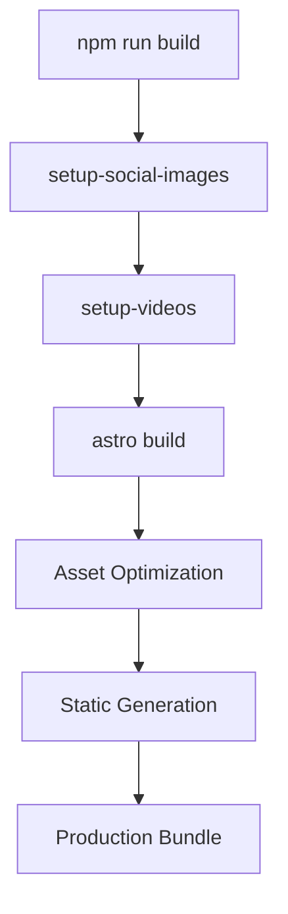

# Development Workflows

This guide covers the development workflows, best practices, and processes for contributing to and maintaining HashBlog.

## 📚 Table of Contents

- **[API Documentation](api.md)** - Search API and endpoints
- **[Styling System](styling.md)** - Tailwind CSS and design system
- **[Testing](testing.md)** - Testing strategies and setup
- **[Component Development](components.md)** - Creating and maintaining components
- **[Performance](performance.md)** - Optimization and monitoring

## 🔧 Development Environment

### Prerequisites

- **Node.js 18+** with npm
- **Git** for version control
- **VS Code** (recommended) with extensions:
  - Astro Language Support
  - Vue Language Features (Volar)
  - Tailwind CSS IntelliSense
  - TypeScript Importer

### Initial Setup

```bash
# Clone repository
git clone https://github.com/yourusername/hashblog.git
cd hashblog

# Install dependencies
npm install

# Start development server
npm run dev
```

### Development Commands

```bash
# Core development
npm run dev              # Start dev server (localhost:4321)
npm run build           # Production build with asset setup
npm run preview         # Preview production build
npm test                # Run unit tests

# Asset management
npm run setup-social-images  # Organize hero images
npm run setup-videos        # Organize video files

# Astro CLI
npm run astro           # Direct Astro CLI access
npm run astro check     # Type checking
npm run astro add       # Add integrations
```

## 🏗 Project Architecture

### Technology Stack

- **Frontend**: Astro 5.8.1 + Vue 3.5.16
- **Styling**: Tailwind CSS with custom design system
- **Content**: MDX with Content Collections
- **Deployment**: Cloudflare Pages with GitHub Actions
- **Type Safety**: TypeScript with strict configuration

### Key Design Decisions

1. **Islands Architecture**: Minimal JavaScript with selective hydration
2. **Static-First**: Pre-generate content at build time
3. **Type Safety**: Comprehensive TypeScript coverage
4. **Performance**: Optimize for Core Web Vitals
5. **SEO**: Built-in optimization for search and social

## 📝 Content Development

### Blog Post Creation Workflow

1. **Create Post Directory**
```bash
mkdir "src/content/blog/$(date +%Y-%m-%d)-post-title"
cd "src/content/blog/$(date +%Y-%m-%d)-post-title"
mkdir images videos
```

2. **Write Content** (`index.mdx`)
```mdx
---
title: "Post Title"
description: "SEO description under 160 characters"
pubDate: 2025-06-30
heroImage: "./images/hero.jpg"
tags: ["Development", "Tutorial"]
draft: true
---

# Your content here...
```

3. **Add Assets**
- Hero image: 1200x630px for social sharing
- Content images: Compress before adding
- Videos: Optimize for web delivery

4. **Preview and Test**
```bash
npm run dev
# Check http://localhost:4321/YYYY/MM/post-slug
```

5. **Publish**
- Set `draft: false`
- Run `npm run build` to validate
- Commit and push for deployment

### Content Guidelines

#### SEO Best Practices
- **Titles**: Under 60 characters, include primary keywords
- **Descriptions**: 120-160 characters, compelling and keyword-rich
- **Headings**: Use H2-H6 hierarchy properly
- **Images**: Include descriptive alt text
- **Internal Linking**: Link to related posts

#### Writing Style
- **Mobile-First**: Write for mobile reading
- **Scannable**: Use headings, lists, and short paragraphs
- **Code Examples**: Prefer syntax-highlighted code blocks
- **Visual Aid**: Include screenshots and diagrams
- **Actionable**: Provide clear next steps

## 🎨 Component Development

### Astro Components

**File Naming**: Use PascalCase (e.g., `BlogCard.astro`)

**Component Structure**:
```astro
---
// TypeScript frontmatter
interface Props {
  title: string;
  description?: string;
}

const { title, description } = Astro.props;
---

<!-- HTML template -->
<div class="component-styles">
  <h2>{title}</h2>
  {description && <p>{description}</p>}
</div>

<style>
/* Component-specific styles (if needed) */
</style>
```

**Best Practices**:
- Use TypeScript interfaces for props
- Leverage Tailwind for styling
- Include JSDoc comments for complex components
- Test with different prop combinations

### Vue Components

**File Naming**: Use PascalCase (e.g., `Menu.vue`)

**Component Structure**:
```vue
<template>
  <div class="vue-component">
    <!-- Template content -->
  </div>
</template>

<script setup lang="ts">
import { ref, onMounted } from 'vue'

// Component logic
const isOpen = ref(false)

onMounted(() => {
  // Initialization
})
</script>

<style scoped>
/* Component-specific styles */
</style>
```

**Best Practices**:
- Use Composition API with `<script setup>`
- Implement proper TypeScript types
- Handle cleanup in `onUnmounted`
- Use reactive patterns appropriately

## 🧪 Testing Strategy

### Unit Testing

**Framework**: Node.js built-in test runner with tsx

**Test Structure**:
```typescript
// tests/url.test.ts
import { test } from 'node:test';
import assert from 'node:assert';
import { getPostUrl } from '../src/utils/url.js';

test('getPostUrl generates correct URL format', () => {
  const result = getPostUrl('test-post', new Date('2025-06-30'));
  assert.strictEqual(result, '/2025/06/test-post');
});
```

**Running Tests**:
```bash
npm test                    # Run all tests
npm test -- --grep "url"   # Run specific test pattern
```

### Integration Testing

**Build Validation**:
```bash
npm run build              # Ensure build succeeds
npm run preview           # Test production build
```

**Content Validation**:
- Schema validation automatically runs during build
- TypeScript compilation catches type errors
- Asset organization scripts validate file paths

### Performance Testing

**Lighthouse Audits**:
- Performance: Target 90+
- Accessibility: Target 95+
- Best Practices: Target 95+
- SEO: Target 95+

**Core Web Vitals**:
- First Contentful Paint < 1.5s
- Largest Contentful Paint < 2.5s
- Cumulative Layout Shift < 0.1

## 🚀 Build and Deployment

### Build Process



### Asset Organization

**Social Images** (`scripts/setup-social-images.js`):
- Extracts hero images from frontmatter
- Organizes in `/public/social-images/year/slug/`
- Enables proper Open Graph meta tags

**Video Setup** (`scripts/setup-videos.js`):
- Copies videos to `/public/videos/`
- Maintains organized directory structure
- Supports multiple video formats

### Deployment Pipeline

**GitHub Actions** (`.github/workflows/deploy.yml`):
```yaml
name: Deploy to Cloudflare Pages
on:
  push:
    branches: [main]
  pull_request:
    branches: [main]

jobs:
  deploy:
    runs-on: ubuntu-latest
    steps:
      - uses: actions/checkout@v3
      - uses: actions/setup-node@v3
        with:
          node-version: 18
          cache: 'npm'
      
      - run: npm ci
      - run: npm run build
      
      - uses: cloudflare/pages-action@v1
        with:
          apiToken: ${{ secrets.CLOUDFLARE_API_TOKEN }}
          accountId: ${{ secrets.CLOUDFLARE_ACCOUNT_ID }}
          projectName: hashblog
          directory: dist
```

## 🔍 Code Quality

### TypeScript Configuration

**Strict Mode**: Extends Astro's strict configuration
```json
{
  "extends": "astro/tsconfigs/strict",
  "compilerOptions": {
    "strictNullChecks": true,
    "noImplicitReturns": true,
    "noImplicitAny": true
  }
}
```

### Code Quality

**Manual Code Review**: Consistent style and best practices
- Follow established patterns in existing components
- Use TypeScript for type safety
- Maintain consistent naming conventions
- Review code before committing

### Git Workflow

**Branch Strategy**:
- `main`: Production branch with automatic deployment
- `feature/*`: Feature development branches
- `hotfix/*`: Critical bug fixes

**Commit Convention**:
```bash
feat: add new blog post component
fix: resolve social image organization bug
docs: update API documentation
style: format code with prettier
```

## 📊 Performance Monitoring

### Build Analysis

**Bundle Size**:
```bash
npm run build             # Standard build process
# Manual bundle analysis via build output
```

**Asset Optimization**:
- Images: Automatic format conversion and compression
- CSS: Tailwind purging and minification
- JavaScript: Code splitting and tree shaking

### Runtime Performance

**Core Web Vitals Monitoring**:
- Manual Lighthouse audits in browser dev tools
- Real User Monitoring (RUM) with Cloudflare Analytics
- Performance monitoring via build output analysis

**Optimization Strategies**:
- Critical CSS inlining
- Image lazy loading
- Prefetch viewport links
- Service worker caching

## 🐛 Debugging

### Development Debugging

**Astro Development**:
```bash
npm run dev -- --verbose   # Verbose logging
npm run astro check        # TypeScript errors
```

**Vue Component Debugging**:
- Vue DevTools browser extension
- Console logging in development
- Component inspection tools

### Build Debugging

**Asset Issues**:
```bash
npm run setup-social-images -- --verbose
npm run setup-videos -- --verbose
```

**Content Issues**:
- Check schema validation errors
- Verify frontmatter syntax
- Test with minimal post structure

## 🔒 Security

### Content Security

**Input Validation**:
- Zod schema validation for all content
- TypeScript type checking
- Sanitized HTML output

**XSS Prevention**:
- Astro's automatic escaping
- Safe external link attributes
- Content Security Policy headers

### Dependency Security

**Regular Updates**:
```bash
npm audit                 # Check for vulnerabilities
npm audit fix             # Auto-fix issues
npm update                # Update dependencies
```

**Security Scanning**:
- GitHub Dependabot alerts
- Automated dependency updates
- Security advisory monitoring

---

This development workflow ensures maintainable, secure, and performant code while providing an excellent developer experience.