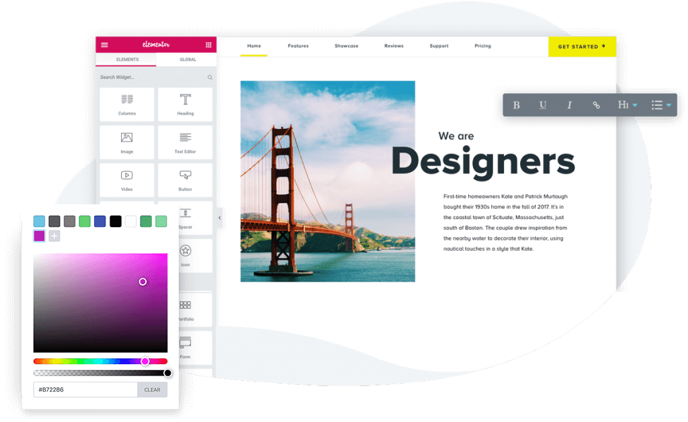

I used to have a blog—back when blogging used to be the cool and hip thing to do. Having followed Seth Godin's [blog](https://seths.blog/top-100/), his [advice](https://web.archive.org/web/20180630171854/https://adage.com/article/digitalnext/digital-marketing-inside-seth-godin-s-blogging-philosophy/137881) on blogs, Austin Kleon's [book](https://austinkleon.com/show-your-work/), and even Ali Abdal's [video](https://www.youtube.com/watch?v=vyVpRiqOvt4) about sharing your work and creating content has made me rethink about writing again. I do have quite a lot of thoughts to share about tech, design, advertising and the odd geeky thing that interests me. Will they be any good? I doubt it.

#### How easy is it to set up a blog

Setting up a blog isn't the most difficult thing to do. [WordPress.com](http://Wordpress.com), [Medium](https://medium.com/), LinkedIn, or even Instagram are great platforms to get your ideas out for free. But for me, I needed it to be simple. Of course, I'm inspired by Seth's blog. And it has been near impossible to find a theme or template as simple as his. So, I decided to build my own.

#### My approach

When I say "build my own", it's a half-lie. In fact, I never wrote a single line of code. I am using a self-hosted [WordPress.org](https://wordpress.org/) setup, with the popular drag-and-drop plug-in [Elementor](https://elementor.com/) (Paired with the [Neve](https://themeisle.com/themes/neve/) theme). With the advent of '[no-code](https://en.wikipedia.org/wiki/No-code_development_platform)' tools (e.g. [Webflow](https://webflow.com/), [Editor X](https://www.editorx.com/), and even Squarespace and Wix), it has become easier to craft what your websites or blogs should look like, and with zero skills or knowledge about coding.

#### Conclusion

While this blog takes a minimalist approach, it took a stupid amount of time for me to actually customise it to my liking. And it took forever to publish my first post—because 'it had to be perfect'. In reality, it would never be perfect. My advice is to anyone thinking of starting a blog (or any endeavour!) go with what works for you—go with what has the least amount of friction.
