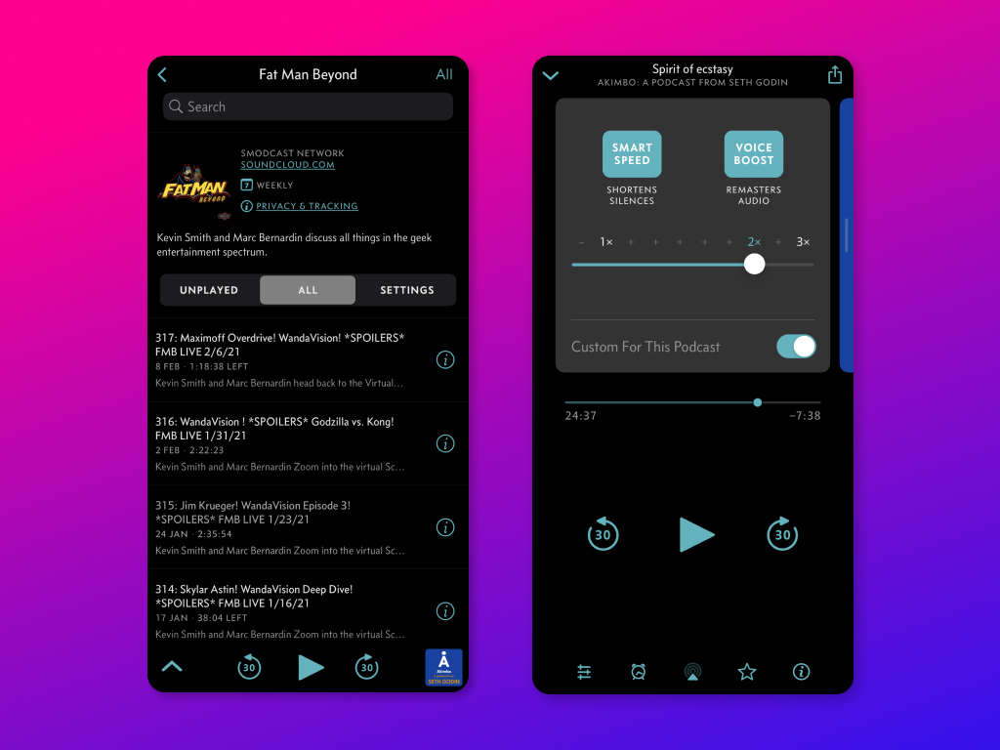
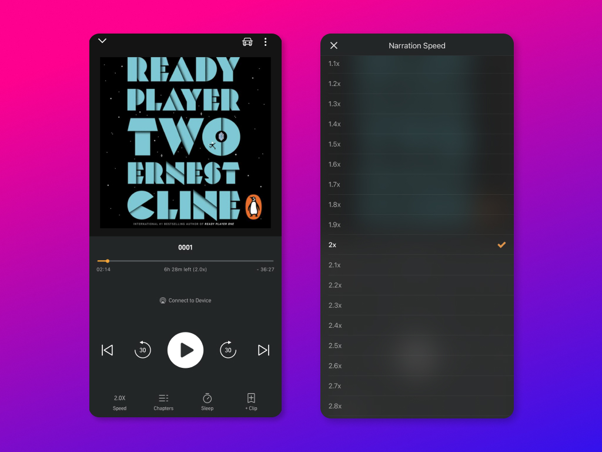
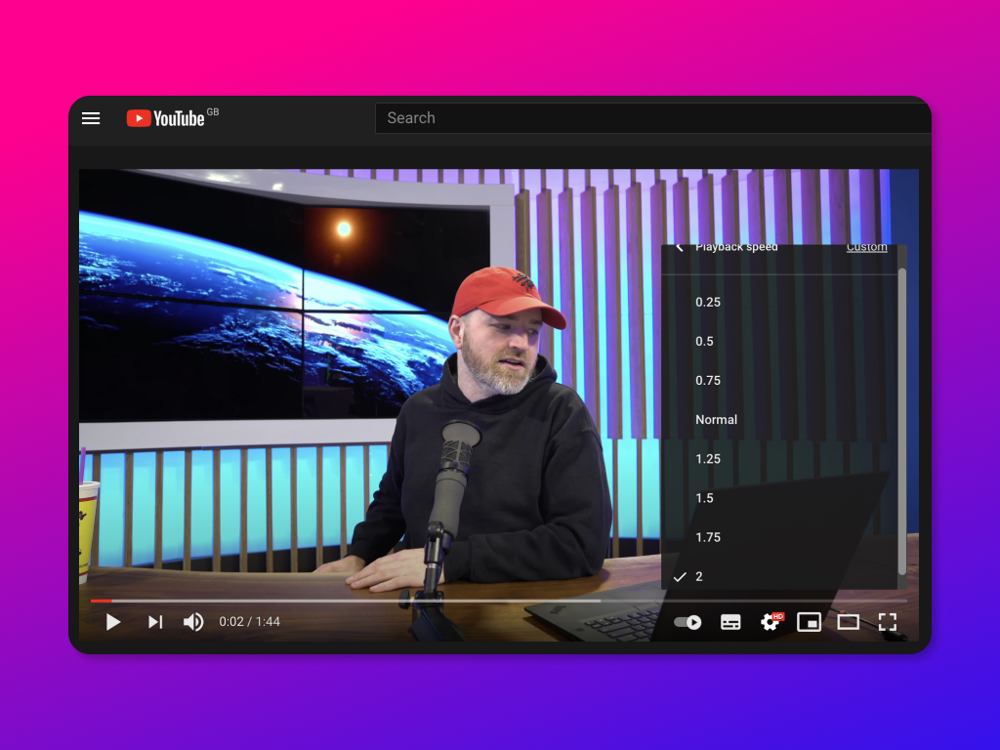

I listen to a lot of podcasts and audiobooks. Before the pandemic, I would get a couple of hours to consume content while commuting back and forth to work. I'd power through so many podcasts and I'd constantly run out of things to listen and seek out for more.

#### An overwhelming backlog

I have been working from home for almost a year and have lost those 2-hours-per-day blocks. As a result, I have an overwhelming backlog of podcasts, audiobooks, Kindle books, physical books, comic books, TV shows, and movies. At a time where there seems to be a lot of time, I have found the opposite to also be the truth. An oxymoron for sure.

#### The revelation

For a few years, I have been listening to my podcasts and audiobooks at slightly faster speeds. Nevermore than 1.5x. I found it difficult to get into anything faster than that.

Since the pandemic, this has changed. I started looking at my backlog and wanted to find efficient ways to get through it—especially the casual non-fiction kind of content. I gave 2x a chance. While comprehension was difficult at first, after a few days it became a lot easier.

2x meant a 40-minute podcast takes only 20 minutes. A 10-hour audiobook takes 5 hours. The backlog doesn't seem as daunting or overwhelming anymore. However, I still consume fiction work at a slower pace and savour the stories as it unfolds.

> _Naysayers would say 'what's the point in rushing? Why not just enjoy life at a slower pace?' Honestly, the main reason is that there's so much good stuff in the world, it's a net positive for me to experience more of it quickly, rather than less of it slowly._
>
> — Ali Abdaal ([source](https://aliabdaal.com/2x-speed-listening-251503/))

#### Platforms I use for speed listening

My podcasting app of choice is [Overcast](https://overcast.fm/). It has an excellent _Smart Speed_ feature that automatically shortens the silences in speech.

<figure>

<figcaption>

Overcast iOS app interface

</figcaption>

</figure>

For audiobooks Audible does a good job. But I hope Amazon would someday have their own _Smart Speed_ functionality.

<figure>

<figcaption>

Audible iOS app interface

</figcaption>

</figure>

I've only recently started watching YouTube videos in 2x. It's really handy for those long Ted talks or super long and boring coding tutorials.

<figure>

<figcaption>

Playback speed setting in the YouTube interface

</figcaption>

</figure>

#### Is speed listening (or watching) right for you?

I'd say give it a go! It may feel unnatural at first, but in time you too may get used to it.

Here's some further reading if you want some convincing:

- 👉🏾 [Ali Abdaal on 2x Speed Listening](https://aliabdaal.com/2x-speed-listening-251503/)
- 👉🏾 [Benefits of Speed Listening](https://medium.com/publishing-well/what-i-learned-from-speed-listening-d4553399bc8b)
- 👉🏾 [The Rise of Speed Listening — The Atlantic](https://www.theatlantic.com/technology/archive/2015/06/the-rise-of-speed-listening/396740/)
