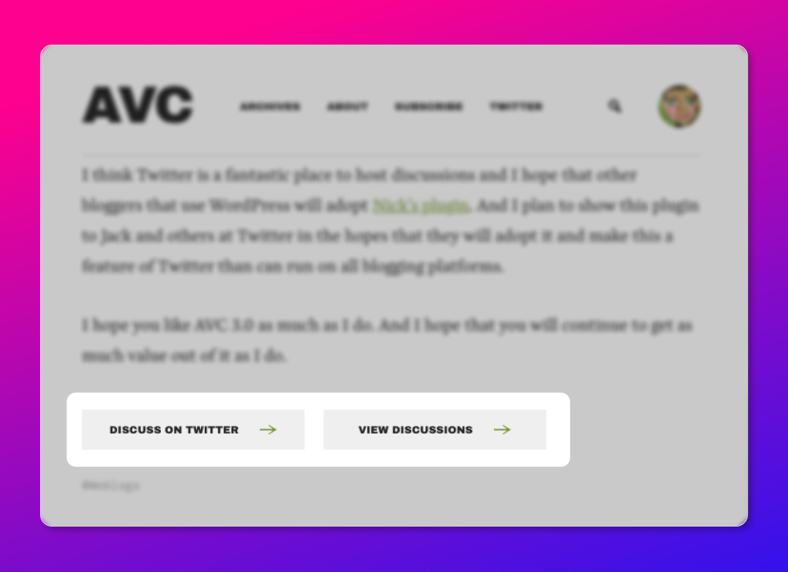

I have been struggling with the decision to include a comment section in my blog—and Twitter appears to be the answer. WordPress already comes with a comment section, and there are other fantastic plug-ins such as [Disqus](https://en-gb.wordpress.org/plugins/disqus-comment-system/) that integrates social elements and essentially becomes a comment section on steroids. Yet, managing these comments sections seemed too much work.

#### The plug-in to the rescue

Then I remembered seeing how discussions were handled at the [AVC blog](https://avc.com/) by Fred Wilson.

<figure>



<figcaption>

Buttons for "Discuss on Twitter" and "View Discussions" at the AVC blog.

</figcaption>

</figure>

As mentioned in the [AVC blog article](https://avc.com/2020/01/avc-3-0/)—Twitter is a naturally good place to host discussions. And [Nick Grossman](https://www.theslowhunch.net/2020/the-discuss-on-twitter-wordpress-plugin/) developed a neat little [plug-in for WordPress](https://wordpress.org/plugins/discuss-on-twitter/)—which is built on top of the functionality of [WP to Twitter](https://wordpress.org/plugins/wp-to-twitter/)—another plug-in that automatically tweets about your new blog posts—which is what's been used on the AVC blog too:

https://twitter.com/nickgrossman/status/1216029402942836736?s=20

#### The Installation

Setting it up was relatively straight-forward—yet needed a little extra setup with a [developer account on Twitter](https://developer.twitter.com/en/apply-for-access) and also some tinkering with the PHP and CSS so the buttons show up below my blog posts just the way I wanted it.

Nick's plugin gives a neat little PHP snippet to add to your single post theme files such as `single.php` :

```php
<?php
	if (function_exists('discuss_on_twitter_button')) {
		discuss_on_twitter_button();
	}
?>
```

But I didn't want to mess with it, as [I built](https://hashir.blog/2021/02/how-to-set-up-an-easy-minimalist-blog/) my templates with Elementor. I could've created a shortcode in `functions.php` ([source](https://wpcodeus.com/how-to-add-php-code-to-elementor/)):

```php
// Shortcode to output custom PHP in Elementor
function wpc_elementor_shortcode( $atts ) {
	if (function_exists('discuss_on_twitter_button')) { discuss_on_twitter_button();
}
add_shortcode(
	'discuss_on_twitter_shortcode',
	'wpc_elementor_shortcode
);
```

This would allow me to use the shortcode within Elementor: `[discuss_on_twitter_shortcode]`

However, I opted to go down the lazy route—to use _another_ [plug-in](https://en-gb.wordpress.org/plugins/insert-ph) that inserted the PHP snippet for me. This meant that I didn't have to worry about child-themes or losing any customisations every time I updated WordPress.

#### Making it look good: The CSS customisation within Elementor

While the default look served the purpose, it was conflicting with the look-and-feel I was going for with this blog. I ended up tweaking it with the following CSS code:

```css
selector .discuss-on-twitter-button {
    font-family: 'Work Sans', sans-serif;
    font-weight: 800;
    background-color: #262626;
    color: #FFFFFF;
    border-radius: 0;
    border-bottom: dotted 1px #FF5682;
    margin: 10px;
    padding: 6px 13px;
}

selector .discuss-on-twitter-button:hover {
    background-color: #FFFFFF;
    color: #000000;
    border-bottom: dotted 1px #000000;
}
```

Which made it look like this:


I've had to do some extra adjustments for other responsive sizes with some `@media` queries and `flex` adjustments. And I think I'm quite pleased with the end results.

If you feel like it, click on the buttons below to discuss on Twitter, or to just view the discussion—if there's any at all! 😅
