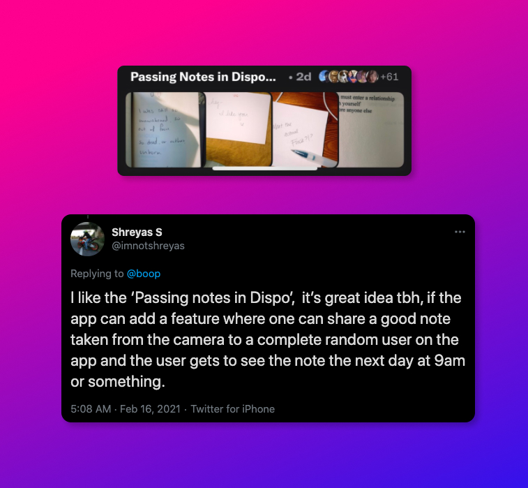
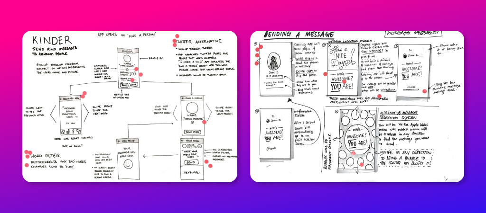

By doing or saying nice things to other people you can make yourself feel happier. That was the [insight](https://gretchenrubin.com/2011/11/the-eight-splendid-truths-of-happiness/) we used to come up with an idea for an app back in 2015.

I was doom-scrolling Twitter last night—enviously watching people share their 'rolls' from David Dobrik's ([yet to be launched, currently invite-only](https://www.axios.com/retro-photo-app-is-winning-buzz-28e343df-d2f8-4cc1-bb82-e3fc12196db5.html)) social media app [Dispo](https://dispo.fun/). Someone [subtweeted](https://twitter.com/imnotshreyas/status/1361542909166686209) a comment about "Passing notes on Dispo" and about how if they could make a feature to send such notes to a random user who gets to see it the next morning.

This reminded me—I had a similar idea—back in 2015.

<figure>

<figcaption>

Link to [tweet](https://twitter.com/imnotshreyas/status/1361542909166686209)

</figcaption>

</figure>

#### Sketching it out

A small team of digital designers and myself got together and tried to answer the question: can we get people to be kind to others by using a simple app?

We set out to create something that allowed users through random encounters to send and receive nice messages to and from strangers. Will it ever work? We doubted that it would. But we tried anyway.

A few days were spent on sketching, sprinting and prototyping:

#### Prototyping the app

We tried to create an interface where the user could slide to pick from a selection of words to form a sentence. Sort of like a simpler version of mad-lib. We hoped that this would minimise the trolling and any form of internet bullying.

#### The app that never left 2015

It was super fun to play around and experiment with interesting ideas and then execute it as a few prototypes. We even did a small scale user testing. There was a lot of excitement around the project and it had a lot of promise. We even tried to sell it to a huge client in the agency. But in the end, it ended up in the ideas graveyard—where it probably truly belongs.

In hindsight, it was probably naive to think that people would want to use such an app. And even if they did—how long would people use it before never using it again? Alas, even if Dispo implemented a similar feature, here's to hoping that it encourages people to share troll-free, genuinely kind and nice messages to random strangers on the internet.
