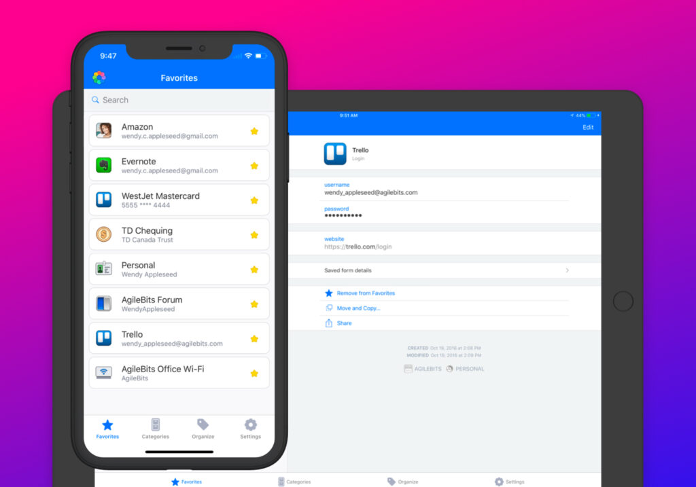
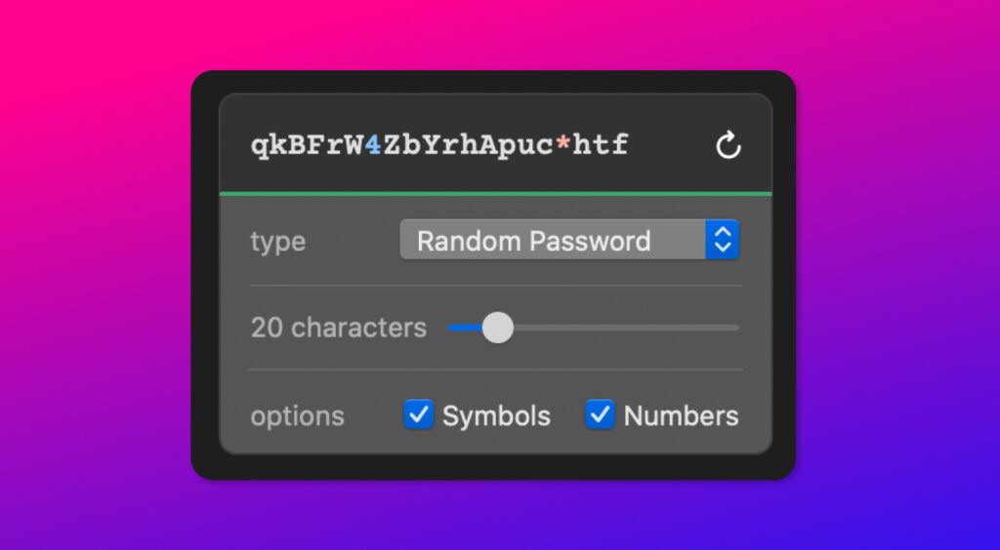
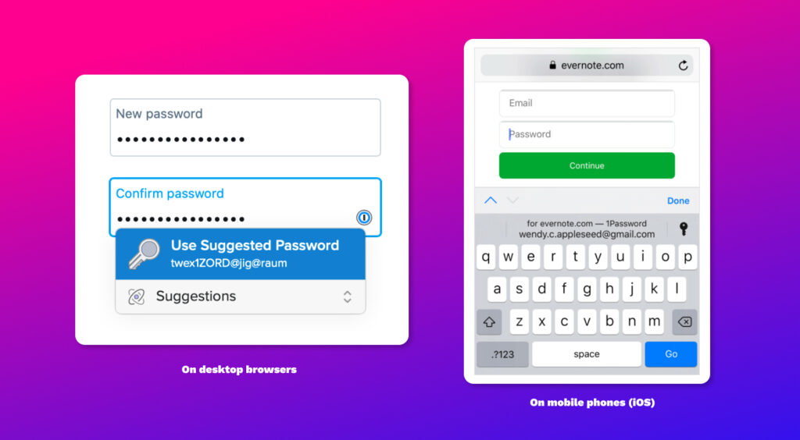

The best piece of tech advice I can give to anyone is—**_get a goddamn password manager_**. It's the one piece of thing that I keep pushing to as many people as possible—like I'm from the damn Jehovah's Witnesses. If my own parents can use it, you can too.

#### Why a password manager?

A good password manager will store all of your website and app login usernames and passwords in one safe and encrypted space. It will also let you retrieve those credentials easily, whenever you need it.

<figure>

<figcaption>

The 1Password app

</figcaption>

</figure>

A good password manager will also let you generate random passwords, with a mixture of characters, from letters, numbers and symbols. It will also let you know if you have reused your password elsewhere, or if it is a weak one. It can look out for [password leaks and dumps](https://haveibeenpwned.com/) by hackers and let you know if you need to change it.

<figure>

<figcaption>

A password recipe maker

</figcaption>

</figure>

#### The best reason for using a password manager

You will never have to remember or memorise all those passwords and pin codes! (Except for just the one Master Password) With all these social media apps and online shopping, we keep creating so-many accounts. [Ain't nobody got time](https://www.youtube.com/watch?v=waEC-8GFTP4) to keep track of all those passwords! Let the password manager do it for you. It's one less thing to worry and stress about—and it will take a huge load off your mind, freeing up your brain to fill up with cat memes or whatever it is that your jam is.

#### The next best reason for using a password manager

You can just copy-paste the password from the app. Or you can have it pre-fill it for you automatically! Yes—it's that easy.

<figure>

<figcaption>

1Password's auto-fill

</figcaption>

</figure>

#### My recommendations

Just use [1Password](https://1password.com/). (There are other recommendations below too.) I'm not getting paid to say this. It's just what I have used for more than half a decade.

Yeah sure, there's Keychain on Safari and Google Password Manager built into Chrome. However, they can remain unencrypted and if someone did get access to your computer or phone while it's unlocked—even for a few minutes—they will get into your no-noes. Which is a big fat no.

1password is a paid service, but if you want something free, then check [LastPass](https://www.lastpass.com/) and [Bitwarden](https://bitwarden.com/). LastPass [came under fire](https://www.theverge.com/2021/2/16/22285531/lastpass-free-tier-mobile-computer-device-premium-family) on Twitter and the press today for restricting their free tier for just one device. Most people will even only need it on one device: their mobile. But I would recommend dishing out the little bit extra dough to get a version where you can have it in multiple devices, and restore it easily in case you lose the said multiple devices. Afterall—it's only your complete digital life you are trying to save.

Just do yourself a favour and get a password manager ASAP!

* * *

#### Further reading

- 👉 [The Best Password Managers to Secure Your Digital Life](https://www.wired.com/story/best-password-managers/) — Wired.com
- 👉 [The password manager to use for 2021](https://www.cnet.com/how-to/best-password-manager/) — CNet
- 👉 [Why you should use a password manager, and how to get started](https://www.howtogeek.com/141500/why-you-should-use-a-password-manager-and-how-to-get-started/) — How-To Geek
