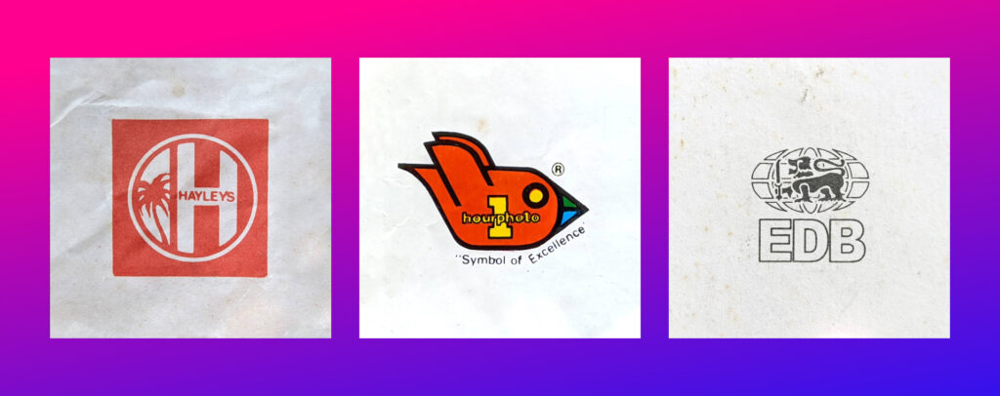
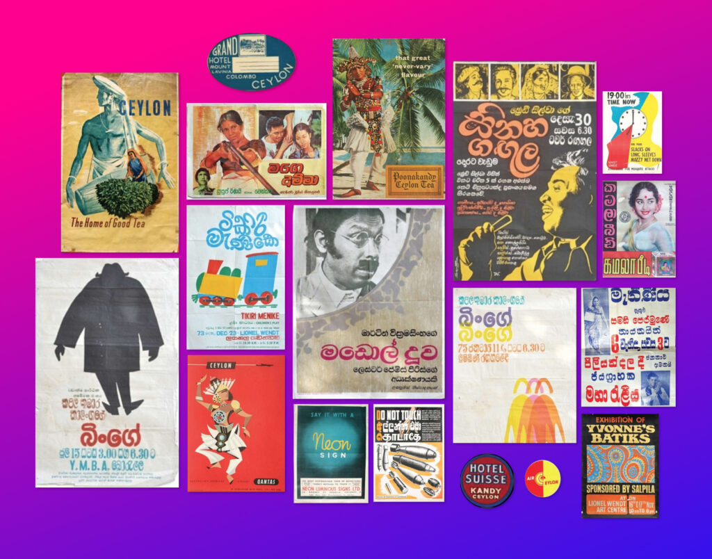

My friend [Indika shared](https://twitter.com/1ndika/status/1360404224631136256?s=20) these old school logos from Sri Lanka, and it made me wonder—is there anyone else collecting and documenting these artifacts? Will they be lost to history and forgotten?

<figure>

<figcaption>

Hayleys, Foto Quick and Sri Lanka EDB logos - collected by [Indika on Instagram](https://www.instagram.com/1ndika/)

</figcaption>

</figure>

I'm from Sri Lanka, and I grew up experiencing colourful and vibrant design work all around me. As I pursued a career in design and advertising, I found it difficult to find the right place to actually study design back then—which was the primary reason for me to move to the UK.

Presently, there are a few colleges and universities in Sri Lanka that offer design courses. However, I fear that none of these places actually cover the vivid history of Sri Lankan graphic design. It feels like many talented homegrown talents that used to produce fantastic work are just forgotten to history. We may have had our own Paul Rands and Saul Basses. But we will never know—or at least I don't!

Several years ago, while visiting family in Sri Lanka, I picked up this gem from the bookshop in Odel Colombo—[Vintage Posters of Ceylon](http://vintagepostersofceylon.com/shop/book) by Anura Saparamadu. Similar books are hard to come by now, even that very book is out of print.

<figure>

<figcaption>

A selection of posters from the book [Vintage Posters of Ceylon](http://vintagepostersofceylon.com/)

</figcaption>

</figure>

With the advent of digital tools, the task of designing and redesigning things such as logos, posters, and adverts has been taken over by somewhat amateur and untrained designers who just happened to know how to use a computer. Several rebrands done for well-known local brands such as the Sathosa and Sri Lanka Post show the true tragedy and the respect legacy design gets.

<figure>

<figcaption>

Rebrands undergone for Sathosa and Sri Lanka Post

</figcaption>

</figure>

I hope that there is enough interest to collect and catalogue some of those fantastic pieces of art and design—like what Indika is doing. I did find [a study that was done at the University of Kelaniya](http://repository.kln.ac.lk/handle/123456789/18778) that looks into the history of Sri Lankan graphic design. Yet, I feel this isn't as accessible to a young budding designer—so I hope Sri Lankan design schools would teach more of the local design history and help retain the talent and legacy from the beautiful island.
