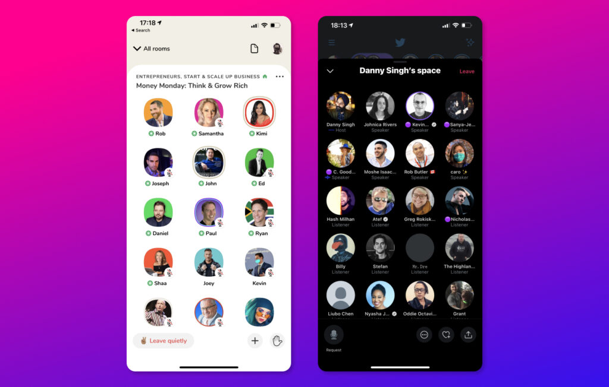

What happens when you mix a Zoom call, a podcast and a Twitch stream? You get _[Clubhouse](https://www.joinclubhouse.com/)_. Or _[Twitter Spaces](https://help.twitter.com/en/using-twitter/spaces)_. Or that thing [Facebook is planning to copy](https://www.nytimes.com/2021/02/10/technology/facebook-building-product-clubhouse.html). [Again](https://www.wired.com/story/copycat-how-facebook-tried-to-squash-snapchat/).

The concept is simple: Someone can be a host and open up a room. They can also assign moderators and speakers. The rest will be spectators who can drop in and out as they wish. Sort of a town hall with a stage—recreated in audio form. Or—if you were a 90's kid—sort of like a Yahoo chatroom where only a few people are allowed to speak.

#### Clubhouse v Twitter Spaces

<figure>

<figcaption>

Clubhouse and Twitter Spaces

</figcaption>

</figure>

_Clubhouse_ is invite-only, yet everybody's cat and their grandmother appear to be on the platform right now. And for some reason, it looks like its full of wannabe hustlers and entrepreneurs who have migrated in droves from LinkedIn. It also has had famous people in the likes Elon Musk, Oprah, Drake, and even YouTubers such as Marques Brownlee.

_Twitter Spaces_ on the other hand is still in beta. If you follow the right people, you will be able to catch these bright purple circles where Fleets should be. Tonally—Spaces feel a bit more chill and relaxed. However, this may be due to the fact that it's still in beta, and only a super small portion of people have access to even host a Spaces-thing on Twitter.

### An audio renaissance

We live in an age where a whole generation is used to communicating via text—be it WhatsApp, iMessage, or DM's on Instagram. Long gone are the days where friends would just pick up the phone and call each other. The pandemic however has forced us into Zoom meets and FaceTime calls, and I think that has the stage set for something like _Clubhouse_ and _Twitter Spaces_ to capture the interest of a whole bunch of people who are looking for new ways to connect. Just enough to reach that tipping point—and just maybe enough to push it to be a major social media platform. An _audio_ led social media platform.

#### Hating before loving it

You know it—every single advertising pitch deck is going to have that one slide with a stupid Clubhouse idea. Clubhouse is going to be dubbed the 'next big thing' and the buzzword that is going to be thrown around in workshops and meetings all around adland. [It's already starting](https://www.campaignlive.co.uk/article/brands-leverage-emerging-audio-platforms-clubhouse/1707946). We will begin to see _'Social Audio'_ as a channel on media plans.

You are going to hate it at first. But when the dust settles there will be new niches formed, a place for like-minded people to congregate and share ideas. And then maybe you will hate it again when '_Clubhouse_ _influencers_' start becoming a thing.

* * *

#### Further reading

- 👉 [Clubhouse vs Twitter Spaces](https://transistor.fm/spaces-clubhouse/) — Transistor FM
- 👉 [Clubhouse started the battle of social audio, but it's Twitter's to lose](https://adage.com/article/opinion/opinion-clubhouse-started-battle-social-audio-its-twitters-lose/2314986) - AdAge
