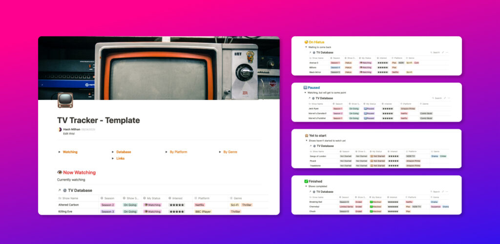

There’s so much content to watch it can be dizzying and overwhelming. There are so many TV shows I’d start to watch and then forget to get back to it. I also get so many good recommendations from friends and see cool new trailers for new tv shows. Or discover old ones that I never got to.

All the streaming platforms and apps available to watch stuff doesn’t help with this either. I’ve used various TV episode tracking services such as [Trakt](https://trakt.tv/) (I still use it). However, I wanted something where I can quickly access, glance, and update stuff. Something where I can organise and cross of stuff based on my own unique preferences.

#### Notion to the rescue.

After being inspired by many awesome [Notion templates](https://www.notion.so/Notion-Template-Gallery-181e961aeb5c4ee6915307c0dfd5156d)—an idea sparked to solve my TV show tracking issues. Notion's superpower lies in its databases. I’ve used just one database and created multiples filtered views based on how I catalogue the progress of watching the shows in my mind.

It’s still work-in-progress and very much incomplete. But for now—it does give me the information I need. This also means it's one less thing for me to think about and clears out that mental space in my brain.

#### The template

_The system is broken down to 5 sections:_

1. _Now watching_
2. _On hiatus_
3. _Paused_
4. _Yet to start_
5. _Finished_

I really wanted a 'paused' section, because there are quite a lot of shows that I've just stopping mid-way—but want to continue watching it sometime later. Having this section will let me know where to continue watching from.

[Get the template](https://www.notion.so/hashir/TV-Tracker-Template-3f095ba3f1f2445aa7a696bd0a4a0fb7)

Feel free to duplicate the template on [Notion](https://www.notion.so/hashir/TV-Tracker-Template-3f095ba3f1f2445aa7a696bd0a4a0fb7) and remix it!
