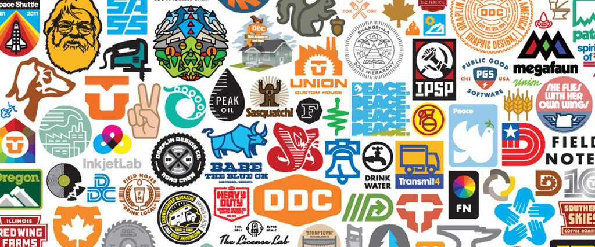

If I had to pick just one designer whose work I really envy—it has to be Aaron Draplin. His use of solid colours and thick lines make his work distinct and unique. Whenever you look at his design pieces—be it a logo or a poster—you can't but just drool over how visually stunning they look.

In my personal design work, I try to draw inspiration from Aaron. Especially how he designs his logos—giving it a timeless look—almost as it was designed by early graphic design legends.

His [Instagram](https://www.instagram.com/draplin/) account is something I'd definitely recommend a gander, especially if you are willing to scroll way back in time to see his amazing collections of '[lost graphic design](https://www.musicbed.com/blog/career/inspiration-from-the-junk-shop-questions-and-answers-with-aaron-draplin/)' work that he finds in scrapyards and yard sales.

#### Some links on Aaron Draplin you should definitely check out:

- 👉 [Making it in the little leagues](https://www.youtube.com/watch?v=_PMK1M7ZxJc) — TEDx Talk
- 👉 [Aaron Draplin Takes on a logo challenge](https://www.youtube.com/watch?v=gVUVUoXrPzM)
- 👉 [His work archive](http://www.draplin.com/1998/01/identity_01_2.html) on Draplin Design Co (DDC)
- 👉 [His Instagram](https://www.instagram.com/draplin/)
- 👉 [Draplin Design Co. Pretty Much Everything](https://www.amazon.co.uk/Draplin-Design-Co-Pretty-Everything/dp/1419720171/) — Design Book _(not an affiliate link)_
