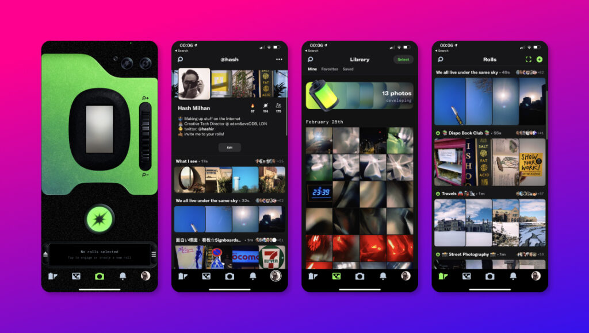

Another social media app? Isn't this just another Instagram or even VSCO? Well... yes, and no. Hear me out, _[Dispo](https://dispo.fun/)_ is different.

As someone who prides on being an early adopter on Facebook, Twitter and Instagram (2006, 2007 and 2010), I'm always super eager to try out anything that's new. Some social apps that have popped up do feel like they were a thing of the moment and either lose popularity, be acquired by one of the tech giants or be copied by a tech giant. (Yes, Facebook, I'm looking at you.)

#### What is Dispo, and why is it different

Unlike most social media apps out there, Dispo works on the concept of delayed gratification. Once a picture is taken, you have to wait until 9am the next morning to have them "developed". Like a good old disposable film camera. You have got no control over the edit, or how they look. The app also introduces the concept of "rolls". These are albums that can be shared with other users—and then collaboratively curate with. When you shoot pictures you can select to shoot directly into as many rolls as you want. The next day when they have been developed you'd see them in the respective rolls. (Or just in your private library if you didn't choose a roll)

The 'disposable camera' aspect of the app has been there for a while, initially as 'David's Disposable'—an idea that was sparked off from one of David Dobrik's project that he did on [Instagram](https://www.instagram.com/davidsdisposable/?hl=en). The social element with the rolls is the recent addition to the app that has sparked some excitement. The inability to edit your photos beforehand means that raw and authentic versions of your photos are shared. Because you can't see your photos until the next day you can just carry on with your day without worrying about organising or editing the photos to instantly share them "_in the moment_". Instead, Dispo takes that pressure off of you and lets you just _live in the moment_.

https://twitter.com/chriscantino/status/1360730843841396736?s=21

#### Will it last or bite the dust?

Dispo has got [investors interested](https://www.tubefilter.com/2021/02/25/david-dobrik-dispo-reportedly-raises-20-million-200-million-valuation/), and looking at the buzz and enthusiasm around it, it does look like it has promise. As long as the team behind it can keep iterating and innovating to keep users come back for the longterm, and as long as they don't get complacent and drop the ball—I think these guys could get their own corner in the market.

Eventually, like with all free platforms, Dispo will have to think of ways to monetising. The most obvious way is advertising—but I struggle to see how brands will fit into the app in a truly integrated way. I'm sure their super talented team has something in their back pockets, or they will think of something!

If you are on Dispo, I'm `@hash` over there. Add me to your rolls!

* * *

#### Further reading

- 👉🏾 [How Dispo Helps Us Tell Nostalgic And Connected Stories](https://www.forbes.com/sites/goldiechan/2021/02/24/how-dispo-helps-us-tell-nostalgic-and-connected-stories/?sh=24823a8e76b6) — Goldie Chan, Forbes
- 👉🏾 [Are Disposables the Future of Photo Sharing?](https://www.nytimes.com/2021/02/25/style/dispo-david-dobrik-disposable-camera-app.html) — Taylor Lorenz, NY Times.
