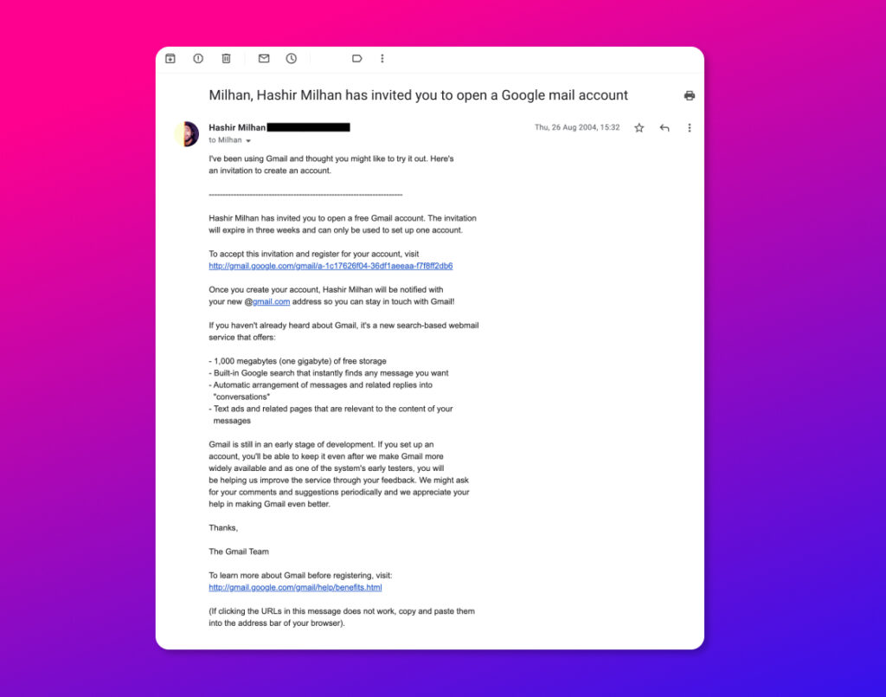
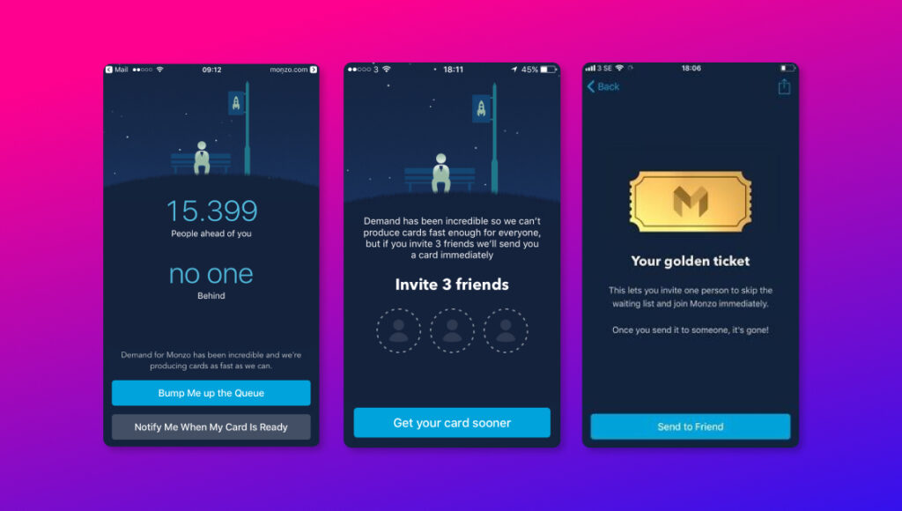

When a new app is launched there are several reasons to make it "\_invite-onl_y". On the surface, it may appear to be some sort of a marketing ploy—to drive interest and hype. Giving the invite a VIP status makes access to the app feel like getting into a super exclusive club.

From a technical point of view, app restrictions are limited by invites because the developers want to keep the numbers down in case something goes wrong. Or it may be because the product is still in its early stages and the devs and designers want to learn how the early users are actually using the app, and then iterate better versions from their findings.

#### My first invite: Gmail

<figure>

<figcaption>

A Gmail invite I sent out in 2004

</figcaption>

</figure>

The earliest such invite I received was for _Gmail_. In 2004 Yahoo Mail was offering 4 megabytes and Hotmail a mere 2 megabytes of Inbox storage. [Then came Google with _Gmail_](https://time.com/43263/gmail-10th-anniversary/). They were offering a whopping _1000 megabytes_! They also announced this on the 1st of April. For a company [famous for making funny make-believe tech products for April Fools Day](https://www.wikiwand.com/en/List_of_Google_April_Fools%27_Day_jokes), this 1 GB mailbox sounded too good to be true. Alas, it was true. After months of looking for one, finally, in August of 2004, I got an invite from my brother, who got it from one of his friends in Cambridge.

#### Monzo Bank

Another recent invite-like app was for the UK banking app, Monzo. When they launched they had a virtual queue. If you invited more people then you'd be bumped up the queue. Later, they introduced Golden Tickets—which worked as invites to the app.

#### Conclusion

There have been so many web services and apps that have launched as invite-only. Recently we've had Clubhouse and [Dispo](https://hashir.blog/2021/02/dispo-add-me-to-your-rolls/) open up as invite-only apps. And they won't be the last. The hype and demand naturally generate so much attention and FOMO. Marketers will use this to their advantage, and make it more than just a dev requirement. I hope that decision-makers behind such apps don't sacrifice the marketing hyperbole for the useful user experience learnings an invite-only launch could bring.
