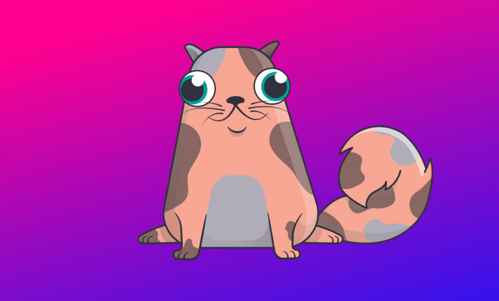

[NFTs](https://www.theverge.com/22310188/nft-explainer-what-is-blockchain-crypto-art-faq)—are all the hype these days. Something that started off with a tradable [Cryptokitties](https://www.cryptokitties.co/) game on the [Etherium](https://www.wikiwand.com/en/Ethereum) network has transformed into a huge area covering NBA, Football, Music and importantly, Digital Art.

<figure>

<figcaption>

My first NFT: Cereal Catson

</figcaption>

</figure>

When I bought my first [Cryptokitty](https://www.cryptokitties.co/kitty/21397) back in 2017—I’ll admit it—it felt super silly. I watched on the sidelines as [Cryptopunks](https://www.larvalabs.com/cryptopunks) came along and the aftermarket kept flipping it for [crazy amounts](https://nonfungible.com/market/history/cryptopunks?filter=nftTicker%3D%25CF%25BE&filter=saleType%3D&length=10&sort=blockTimestamp%3Ddesc&start=0). Today we have so many [NFT marketplaces](https://dappradar.com/blog/top-7-nft-marketplaces-beginners-guide) that have their own tokenised bits of collectables on a blockchain.

If you are still reading and have no idea what the hell an NFT is, here is a [primer](https://www.youtube.com/watch?v=a8ww4aNlPQU). Also, check the Further Reading section below.

#### Comic Books: Entering a market full of collectors

Comics fans are already into collecting single issues, hard covers, action figures and statues. Even my first foray into trading and collection was this DC and Marvel sticker book.

<figure>

<figcaption>

These 'Souvenir Albums' were popular in Sri Lanka back in the 80s and 90s

</figcaption>

</figure>

The comic book genre alone has so many artists creating commissioned and fan art. [Bosslogic](https://www.instagram.com/bosslogic/?hl=en) started making fan art, and now he makes official movie posters for some of the biggest movie studios. There are also a lot of huge names in the comic art world from the DC's Jim Lees. Deadpool's Rob Liefelds to Spawn's Todd McFarlanes. An then there are a lot of other indie comic artists who churn out so much amazing art consistently.

If publishers and comic artists got together, they can start minting NFT's in so many ways. There are a [few artists already](https://medium.com/portion/marvel-artists-add-25-nfts-to-portion-io-platform-fueling-mainstream-nft-adoption-37cd9324dbfa) who are [minting](https://cointelegraph.com/news/spiderman-nft-sells-for-12-75-eth-as-marvel-comic-artists-land-on-ethereum) some of their art.

_Here are some of my ideas as to how it could be done:_

#### **Cover arts can be variant NFTs**

A limited-edition collection of cover art variants on a flagship DC or Marvel title: the NFT itself could be a motion graphic or a 3D render of the cover. The owner of the NFT would get a signed CGC certified comic, along with framable print. They will also be able to unlock an augmented reality layer, allowing them to see the artwork on the cover come to life.

#### Action figures can be NFTs

Create unique action figures based on popular characters from their IPs. The video file that gets minted will show the digital 'action figure' inside the plastic packaging or box. The owner for the NFT will get a real-life version of it, but also an unlockable digital version where they get to see the action figure out of the box. They will also get access to an AR version of an interactive action figure to play with.

Just imagine if FunkoPops started dropping some NFTs!

### Conclusion

Art is hard. Hell, creativity is hard. Making a living out of it is even harder, especially if you are starting out. There are also a lot of talented artists who never get the chance or catch a break. What NFTs and the whole crypto art movement has done is allowed a new era of artists to have their moment.

The comic industry has been through its [own bubble](https://screenrant.com/the-comicspeculator-bubble-explained/). So I'd imagine the comics industry will be extremely cautious getting into something like the NFT craze that's happening right now. However—it's about goddamn time comic book artists get a share of the pie!

* * *

#### Further reading

- 👉 [**What is an NFT & How do I make money from selling my art as a NFT?**](https://loopifyyy.medium.com/what-is-an-nft-how-do-i-make-money-from-selling-my-art-as-a-nft-bb91811b93df)
- 👉 [NFTs, explained](https://www.theverge.com/22310188/nft-explainer-what-is-blockchain-crypto-art-faq) — The Verge
- 👉 [The explosive (and inclusive) potential of NFTs in the creative world](https://techcrunch.com/2021/03/02/explosive-inclusive-potential-nfts/) — Tech Crunch
- 👉 [The NFT Bible](https://opensea.io/blog/guides/non-fungible-tokens/) — OpenSea
