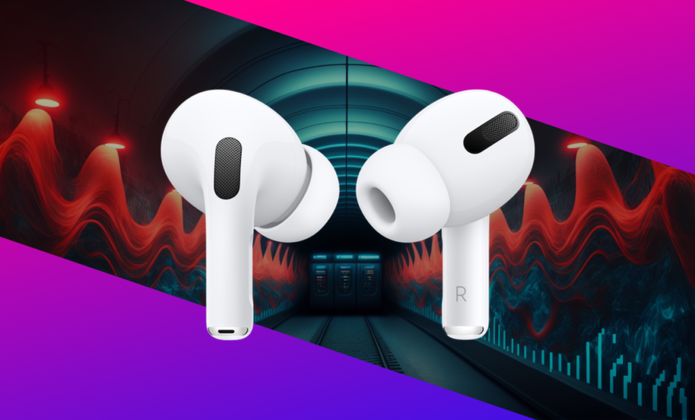

My wife bought me a pair of AirPods Pros for my birthday, and I have to say, they're one of those things that I now can't live without.

---

It was just a few days before my birthday and I was dying to get my hands on the AirPods Pro. I had been reading reviews and watching YouTube videos about them for days, and I couldn't stop talking to my wife about how much I needed them. They're not exactly cheap, so I wasn't expecting anyone to buy them for me as a gift, so I was prepared to splurge on them myself. I had even navigated to the John Lewis website and had the AirPods Pro sitting in my checkout cart, ready to hit the "pay" button.

But something seemed off - my wife kept asking me if I was sure I wanted to buy them right away, and if I had really thought it through. Of course I was sure! Or so I thought. Little did I know, she had already gotten me the AirPods Pro as a surprise birthday gift and was somewhat annoyed with me for ruining the surprise. Oops! How was I supposed to know?

I'd been using Bose QC 35s for a while and, don't get me wrong, they were fantastic headphones — the noise cancellation and comfort were unbeatable. Plus, the Bluetooth connection meant no more tangled wires, and the ANC was especially convenient on the loud Bakerloo line of the London Underground. The only downside was their size; they weren't exactly portable.

But then I got my hands on the AirPods Pro, and let me tell you, it's been a game-changer. Sure, the noise cancellation and sound quality might not be quite as impressive as the Bose, but the size of the AirPods more than makes up for it. I take them with me everywhere — while cooking, commuting, on walks, and even when I'm just lounging in bed, watching something on my phone.

The only issue I had with the AirPods was constantly losing them around the house or in the car. But then I discovered that you can purchase [cases for the AirPods Pro that also hold an AirTag](https://amzn.eu/d/13ddXa5), which means I can track them down if I misplace them. Admittedly, the case does make them a bit bulkier, but it's a small price to pay for never losing my AirPods again. Plus, I've heard that the latest version of the AirPods Pro has FindMy built into the device, but I'm not quite ready to shell out £250 for an upgrade just yet. All in all, the AirPods Pro have been an absolute godsend, and I can't imagine life without them now.

#### Further reading

- 👉 [The Verge's review of the original AirPods Pro](https://www.theverge.com/2019/11/1/20942472/apple-airpods-pro-review-design-price-specs-features-noise-cancellation)
