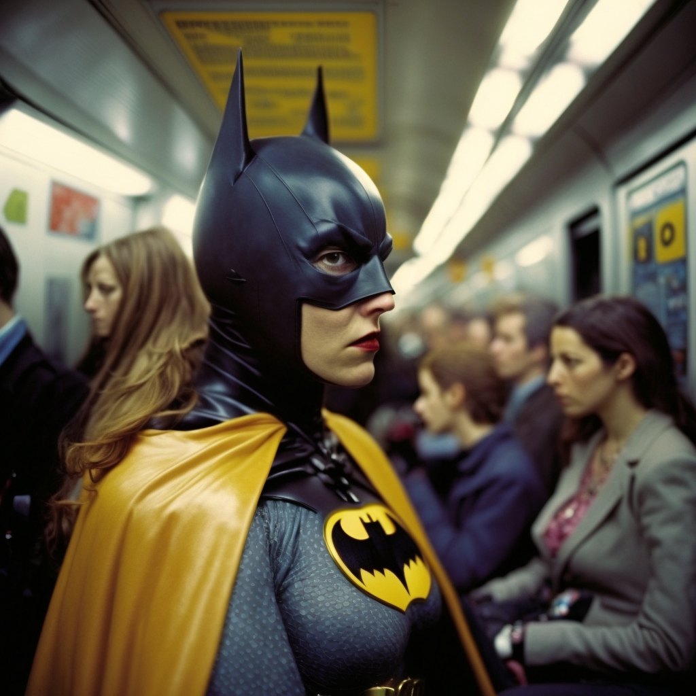
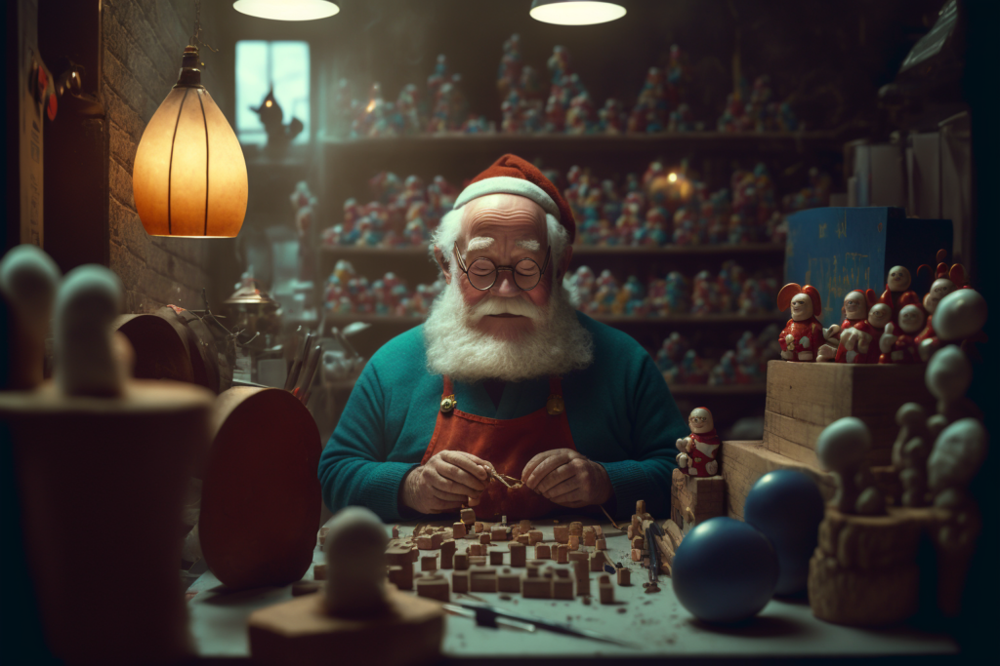
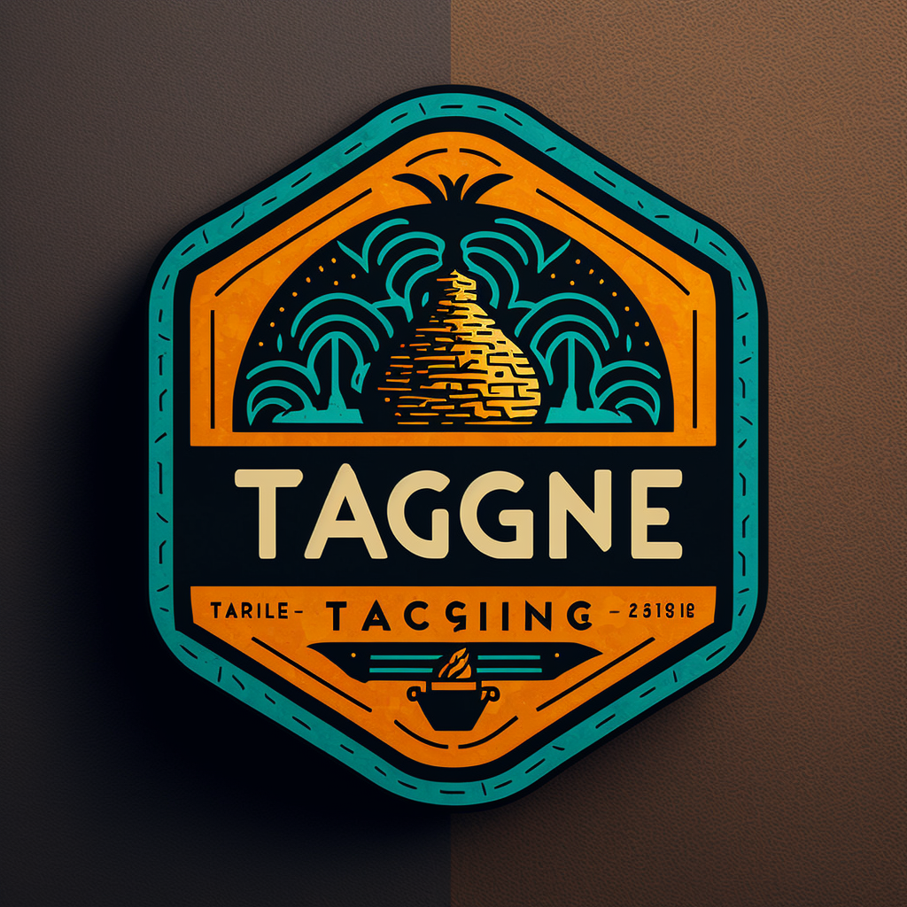
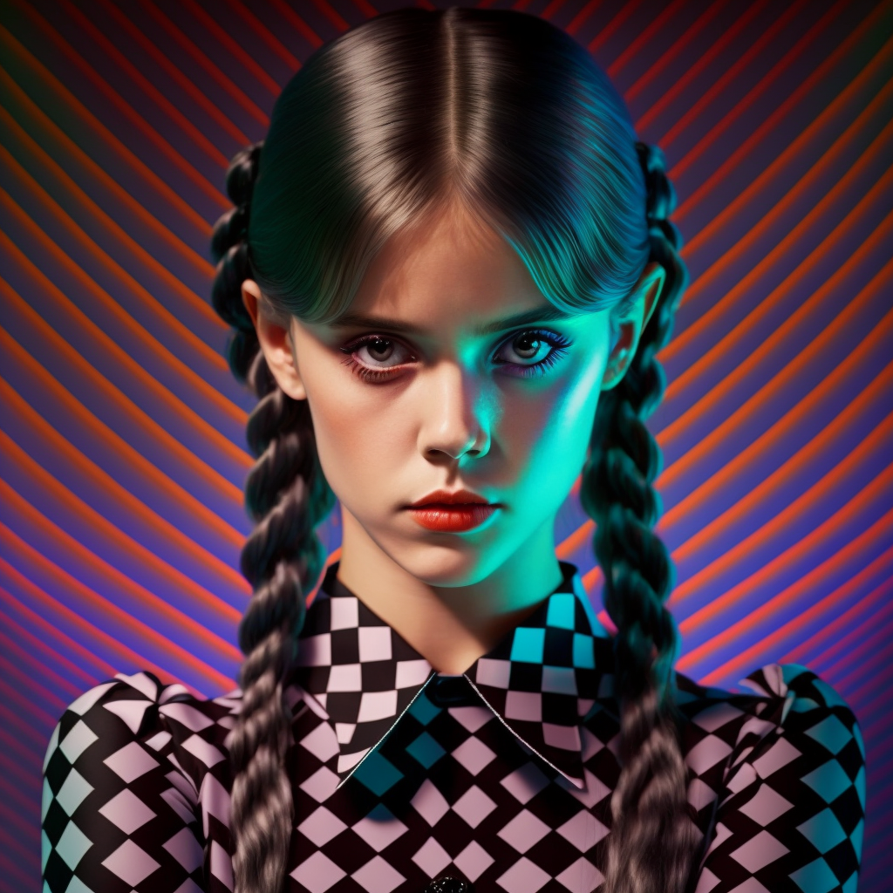
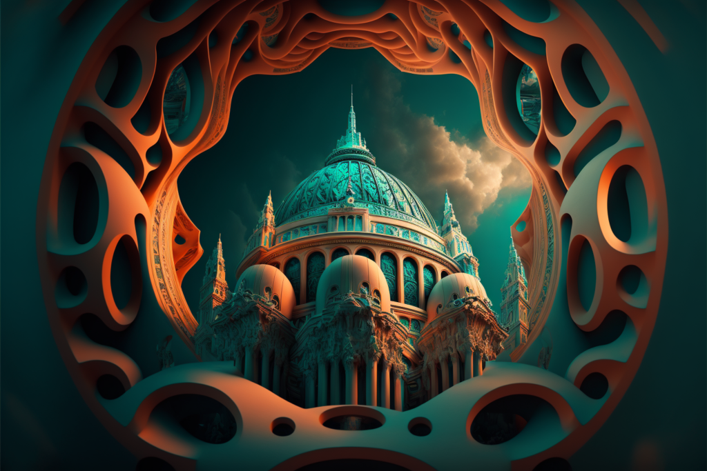
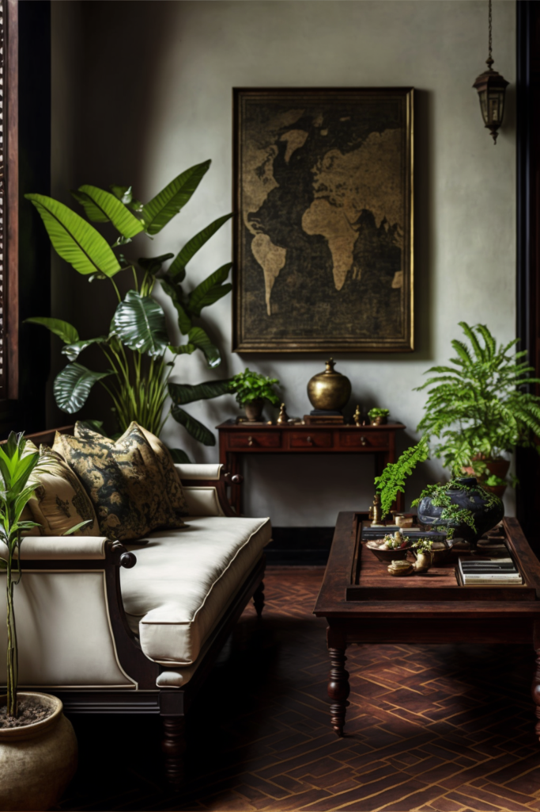
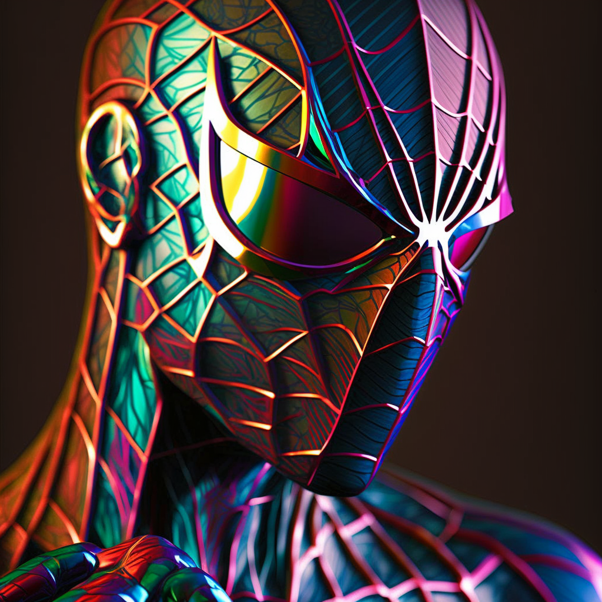
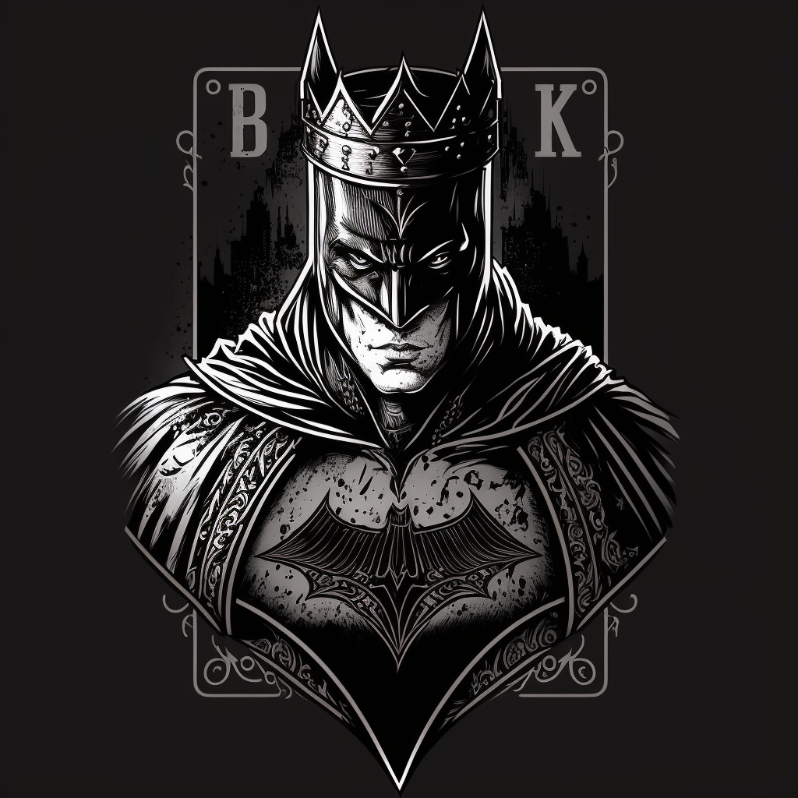
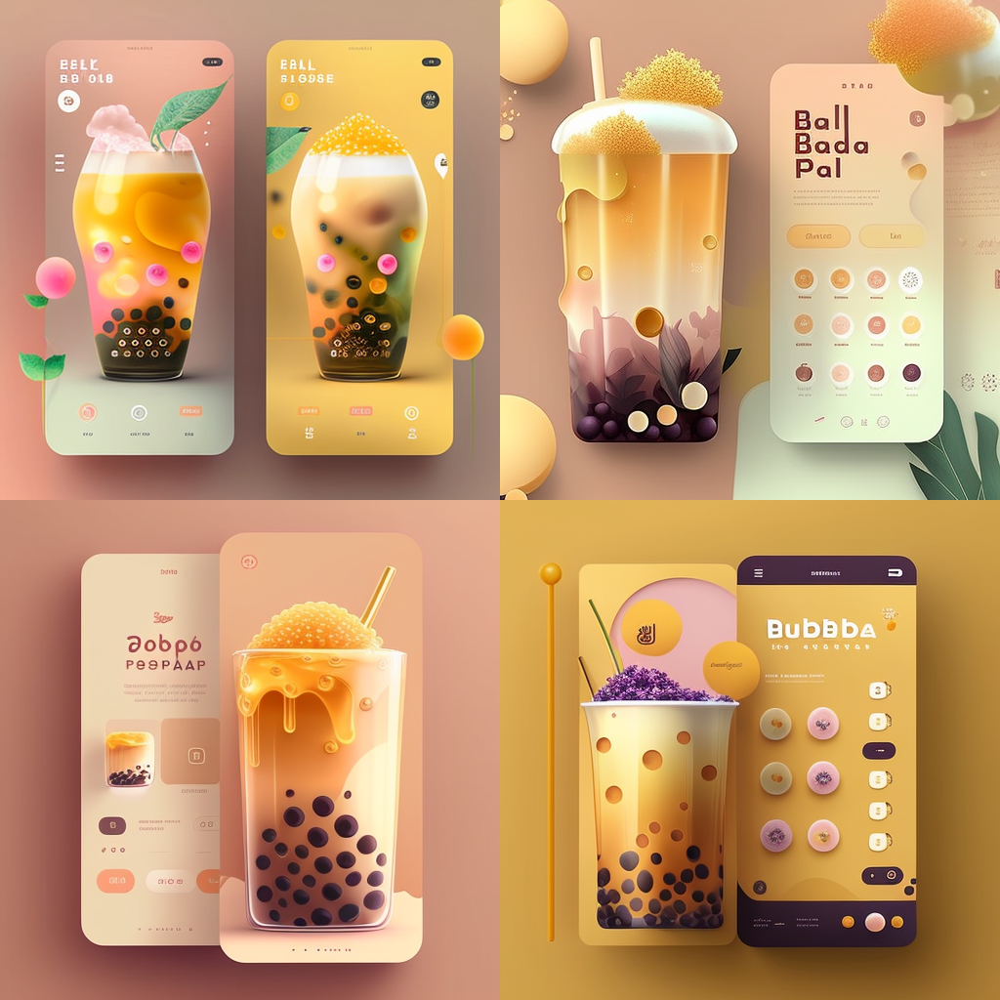
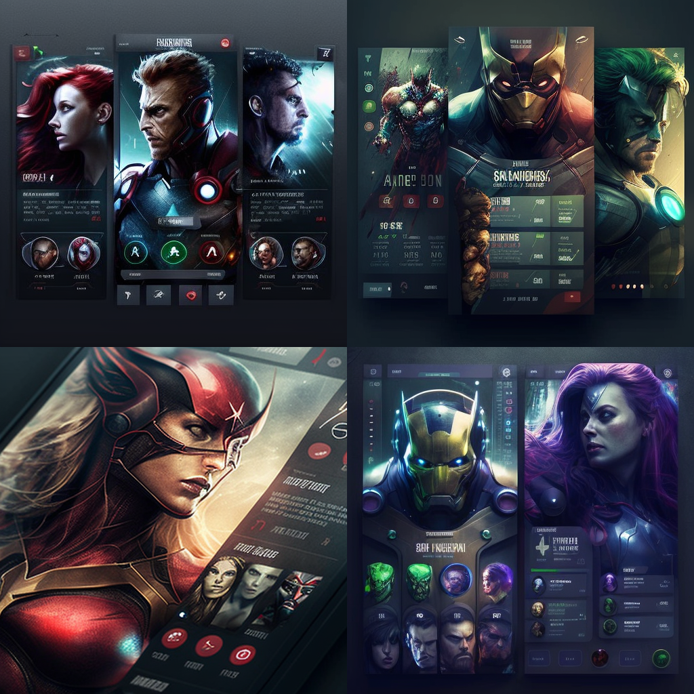

AI art has quickly become one of the most talked about topics in the town.

There are many of these AI generators out there, such as [Dalle-E 2](https://openai.com/dall-e-2/), [Stable Diffusion](https://stability.ai/blog/stable-diffusion-public-release), and especially the new version of [Midjourney](https://midjourney.com/home/?callbackUrl=%2Fapp%2F) (v4), which is capable of producing unbelievable results and has quickly become super addictive.

I have used it to generate photorealistic Polaroids, film photos from the 80s, and even futuristic imaginations. I have also asked it to generate graphic design, including websites, apps, dashboards UIs, movie posters, book covers, logos, and billboard ads — the possibilities are endless.

Despite some quirks, these AI-generated works are great sources of inspiration and provide a solid foundation for designers looking to get started.

_Here are some examples (with prompts) that I made using Midjourney._

---



```plaintext
batgirl with mask in the London Underground, metro, realistic, shot on 70mm, dslr, hyperreal, volumetric lighting, kodak portra 400, crowd  --q 2  --v 4
```

---



```plaintext
Santa Claus in toy workshop, in the style of Wes Anderson, photorealistic, cinematic, shot on 30mm --ar 3:2  --v 4
```

---



```plaintext
logo for tagine, designed by Aaron Draplin  --q 2  --v 4
```

---



```plaintext
<https://s.mj.run/Ah61MoK_zoU> holographic op art glamor portrait  --q 2  --v 4
```

---



```plaintext
city of London in the style of Islamic Architecture, volumetric ultra high detail, dramatic sky, teal and orange colour palette, 8k --q 2 --ar 3:2  --v 4
```

---



```plaintext
interior design of Sri Lankan living room, designed by Geoffrey bawa, for modern times with earthy finishes and cozy detailing throughout, plants --ar 2:3  --v 4
```

---



```plaintext
spiderman with mask holographic op art glamor portrait  --q 2  --v 4
```

---



```plaintext
playing card king Batman, line art illustration  --q 2  --v 4
```

---



```plaintext
beautiful app design for bubble tea, ux, ui, ux/ui, behance, dribbble::5  --q 2  --v 4
```

---



```plaintext
beautiful app UI design, the avengers, marvel superheroes, behance, dribbble::5 --v 4 --q 2  --v 4
```

---

#### Further reading

👉 [Colpetty](https://www.instagram.com/colpetty/) - My Instagram account where I post all my AI experiments
