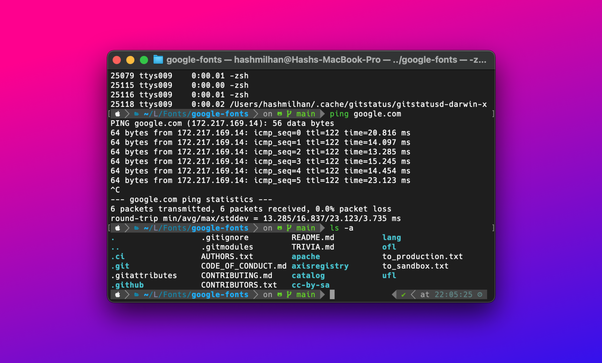

I have been getting back to writing code with Python. And this means working with my Mac's terminal a lot. I have spent a lot of time in the past customising and making it look pretty - because, as a designer, the terminal is just too plain and ugly. This time, I didn't want to spend too much time and just start coding and experimenting.

I've heard about Oh My Zsh before but never played around with it. Finally decided to give it a go and Oh My Zsh it's good! There are so many pre-made themes to select, and a lot of useful plugins to help you with whatever you need.

