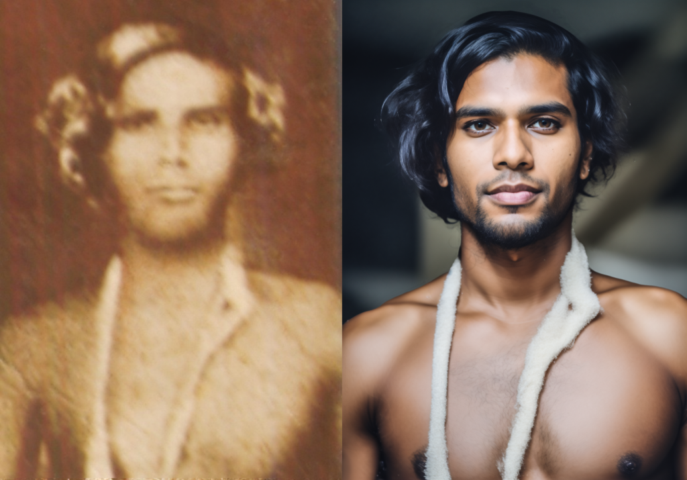
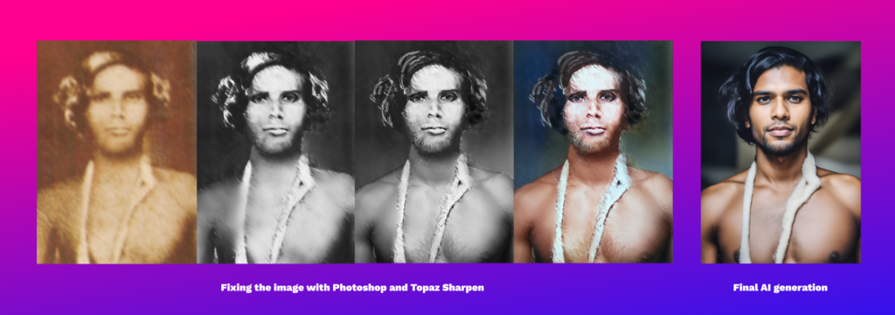
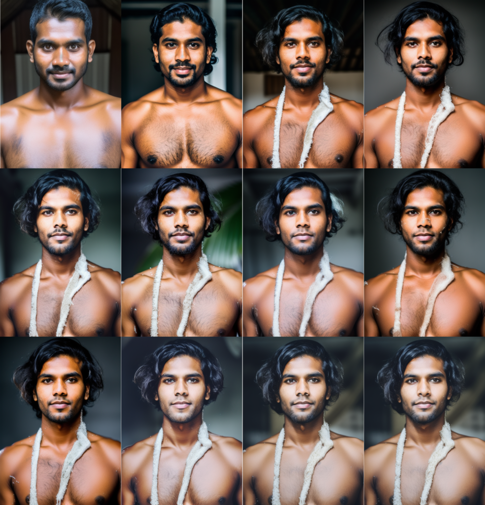
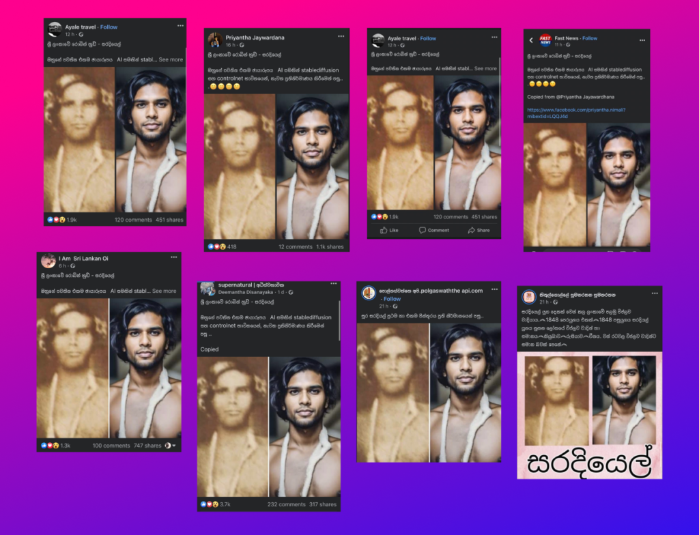

Saradiel, also known as the Robin Hood of Sri Lanka, is a folklore hero who lived during the British colonial period. There are very few photographs of him, and most of them are blurry. However, using AI, I was able to recreate a realistic photo of Saradiel. In this blog post, I will discuss how I achieved this using Stable Diffusion and the ControlNet extension.

<figure>

<figcaption>

Saradiel - a before and after picture. The original blurry old photo in the left, and the hyper realistic AI generation on the right

</figcaption>

</figure>

## Using Stable Diffusion and ControlNet Extension

To bring life to a very blurry image of Saradiel, I first spent a few hours on photoshop fixing the photo and sharpening it with [Topaz Labs Sharpen](https://www.topazlabs.com/sharpen-ai). After that, I painted over details in Photoshop to enhance the image. Then, I fed the image into the 'img2img' tab in [Automatic1111](https://github.com/AUTOMATIC1111/stable-diffusion-webui), which is the Stable Diffusion web UI I used. I also used the same image as guidance using [ControlNet](https://github.com/lllyasviel/ControlNet) Canny.

<figure>

<figcaption>

The workflow of creating Saradiel in AI

</figcaption>

</figure>

I had to make over 100 generations to try and get a good image. In the future, I may try to merge several of these, so that the best features from multiple photos can be in one.

## Astonishing Results

https://twitter.com/hashir/status/1641117208783863808

Although the results were not perfect, they were quite astonishing. I was able to recreate a realistic photo of Saradiel, something that was not possible before. I immediately posted the work on Twitter, which was received well by the Sri Lankan audience. However, it was fascinating yet disappointing to see that many Sri Lankan meme Facebook pages reposted my work without any credit.

Is this my viral moment? 😅

## Conclusion

Using AI, I was able to recreate a realistic photo of Saradiel, a folklore hero in Sri Lanka. Although the results were not perfect, they were impressive considering the blurry nature of the original image. I hope this work will inspire others to use AI to recreate historical figures and events.
