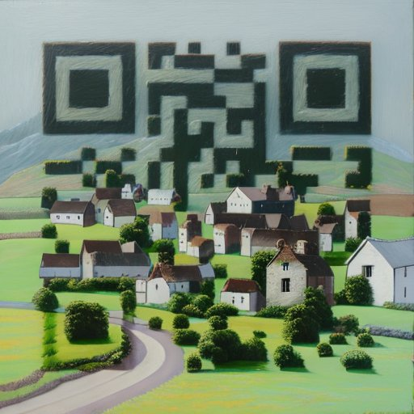
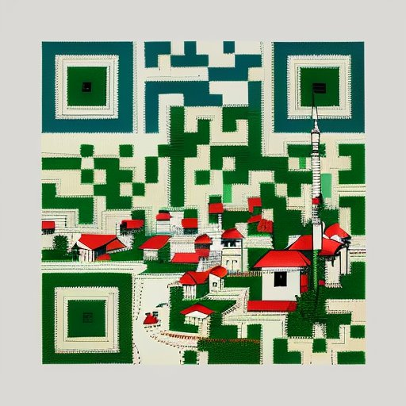
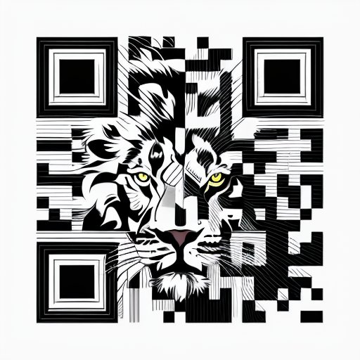
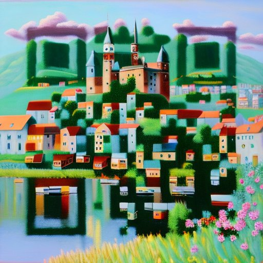
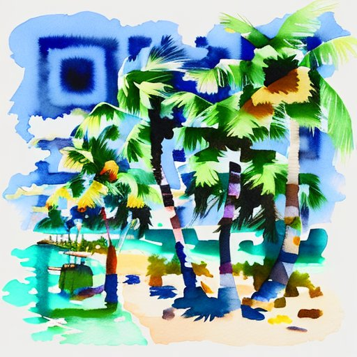

QR codes are everywhere these days. For the longest time, people resisted using them because they looked ugly, you needed to download a separate app to scan them, and frankly, they were a hassle. But since the pandemic, QR codes have seen a major revival. Plus, we're starting to see a lot of creative hacks to make QR codes look good and blend well with solid design and illustrations.

Creating good-looking custom QR codes manually can take a lot of trial and error, and a lot of time. You also need to know the nuts and bolts of how a QR code actually works. But thanks to AI, all of this can be simplified. You can take an existing image, or just prompt anything you can dream up, and merge it with your QR code.

Here are a few more QR codes I've made with AI:

###### Here are the details and setting I used to make my AI-generated QR codes:

- ‣ Use a QR code generator with high correction level. This is what I used - [https://calcpark.com/qr-code-generator](https://calcpark.com/qr-code-generator)

- ‣ Get the ControlNet Tile model from here - [https://huggingface.co/lllyasviel/ControlNet-v1-1/blob/main/control_v11f1e_sd15_tile.pth](https://huggingface.co/lllyasviel/ControlNet-v1-1/blob/main/control_v11f1e_sd15_tile.pth)

- ‣ Get the ControlNet Brightness model from here - [https://huggingface.co/ioclab/ioc-controlnet/blob/main/models/control_v1p_sd15_brightness.safetensors](https://huggingface.co/ioclab/ioc-controlnet/blob/main/models/control_v1p_sd15_brightness.safetensors)

###### The Settings I used within Stable Diffusion and ControlNet are below

I personally use [Vlad Diffusion (SD.Next)](https://github.com/vladmandic/automatic), but it will work with Automatic 1111 too.

- ‣ Steps: 22

- ‣ Sampler: DPM++ 2M Karras

- ‣ CFG scale: 6, Seed: 1597248777

- ‣ Size: 512x512 or 768x768 (this can be upscaled later)

- ‣ Model: dreamshaper_631BakedVae

- ‣ Clip skip: 1,

- ‣ ControlNet 0:

  - ‣ ‣ preprocessor: inpaint_global_harmonious

  - ‣ ‣ model: control_v1p_sd15_brightness

  - ‣ ‣ weight: 0.35

  - ‣ ‣ starting/ending: (0, 1)

- ‣ ControlNet 1:
  - ‣ ‣ preprocessor: inpaint_global_harmonious

  - ‣ ‣ model: control_v11f1e_sd15_tile

  - ‣ ‣ weight: 0.65

  - ‣ ‣ starting/ending: (0.21, 0.71)
