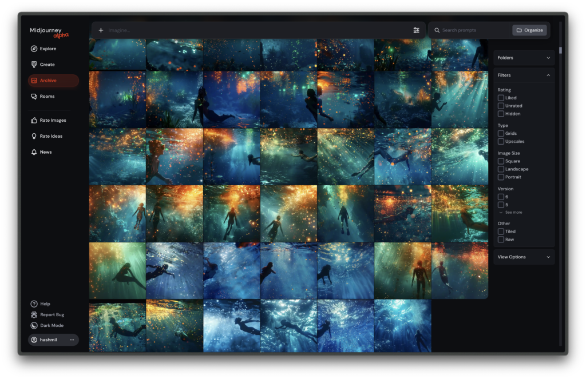

This is a short AI film I made in under 4 hours. It was for a competition where we had to make something in 48 hours. Work and life got in the way, so I had less than 4 hours.

<YouTube id="F53svE8ymYQ" />

Gen AI video has come a long way. It may not be perfect, and until we get access to something like Sora, the tools we have seem to allow creators to do tremendous things. As long as we can embrace its quirks, we can do some incredible things.

The original story for this was written by my wife [Laaiqah](https://www.linkedin.com/in/laaiqahaslam/), but with the time restraints, I ended up shortening and butchering the story (Maybe it's something for another day!). I used [Pika](https://pika.art/) for the video, [ElevenLabs](https://elevenlabs.io/) for the voice-over, [Udio](https://udio.com/) for the music, and [Claude](https://www.linkedin.com/feed/hashtag/?keywords=claude&highlightedUpdateUrns=urn%3Ali%3Aactivity%3A7195207661162844160) for some script help. The imags were first made using Midjourney, and then used them to generate the videos

This will not win any awards, I know that. (It didn't!) But it was so much fun experimenting and working with the tools to actually make something!
