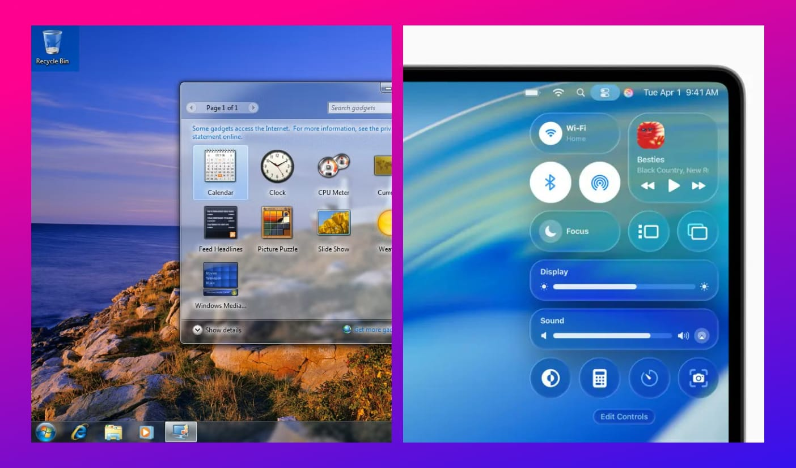
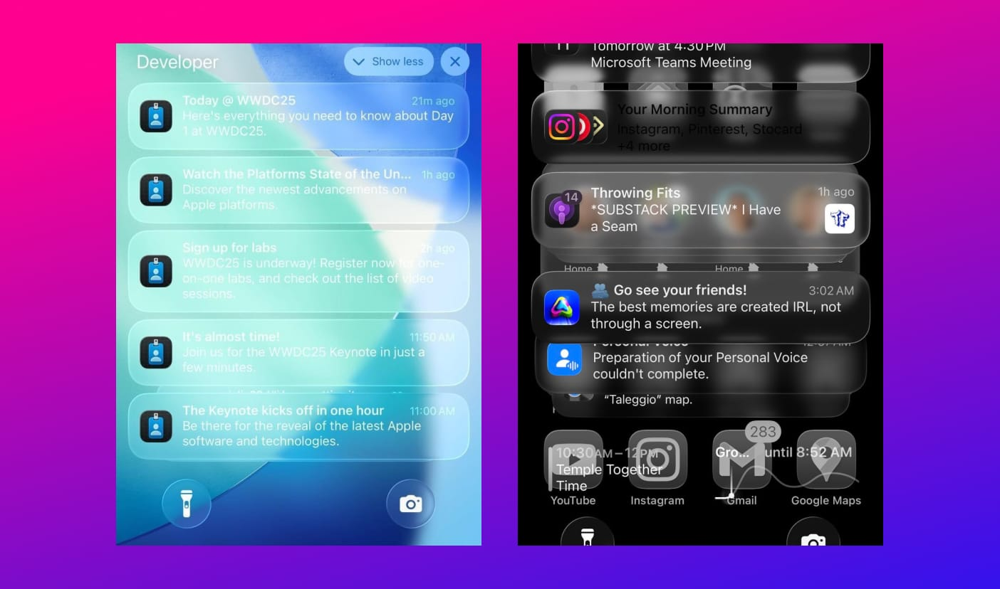
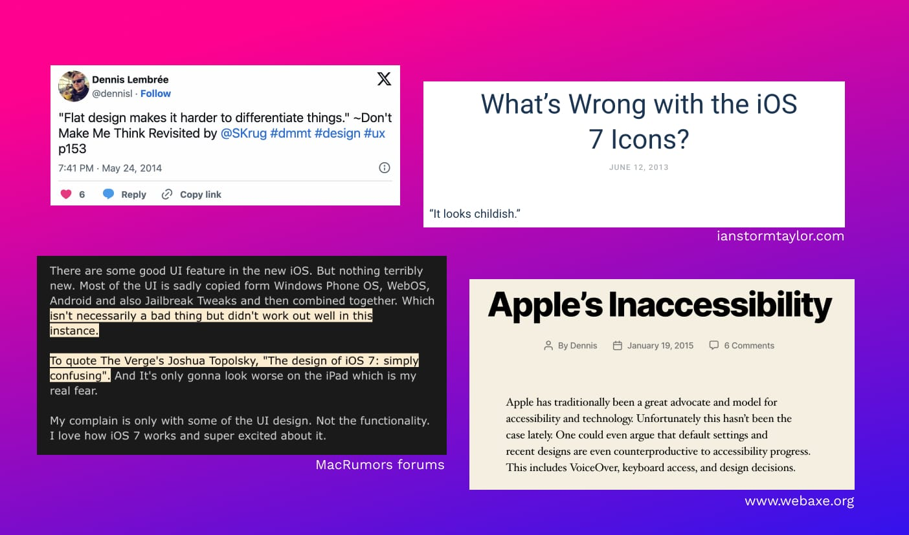

import liquidGlassDemo from "./videos/liquidglass.mp4";

Apple just showed its new design, _["Liquid Glass."](https://www.youtube.com/watch?v=jGztGfRujSE)_ It's the biggest change to how its software looks in over ten years. And a lot of people have strong opinions. Most of the talk I see is negative. But as a designer, I'm excited about it.

<video
  src={liquidGlassDemo}
  autoplay
  loop
  muted
  playsinline
  style="width: 100%; height: auto; border-radius: 8px; margin: 1rem 0;">
  Your browser does not support the video tag.
</video>

#### First, the problems.

I see the problems though. I'm not ignoring them. The first thing everyone said was that it looks like Windows Vista. And you can see the comparison. But the real problem for me, as a designer, is usability. It's about readability.

It's not just the blur effect on its own. The issue is how that glass texture sits on top of different backgrounds. When a [light-coloured notification appears over a light wallpaper](https://x.com/XorDev/status/1932806621161300225), the text becomes hard to read. The system isn't always switching the text to a darker colour to create enough contrast. That makes it hard to use day-to-day. Function should always come before looks.

And I have to say, it doesn't feel very "Apple" right now. For years, Apple's design was sharp and distinct. You knew it when you saw it. While this visual language is bold,I worry it might lose some of that strong identity we're used to.

#### But we've definitely seen this happen before.

This whole situation reminds me of iOS 7 back in 2013. Apple switched from skeuomorphism - a design full of realistic leather and paper textures to a very flat design. The outcry was huge. Everyone said the new icons were ugly and the super thin fonts were impossible to read. It was a massive change, and people complained loudly. This feels exactly the same.

#### It's just a beta.

The key thing people are forgetting is this is a developer beta. It is not the final product. As someone who works in tech, I know this is the whole point of a beta. It's released so people can find problems. Apple is definitely listening to all this feedback right now. With iOS 7, they thickened the fonts and made changes before the public got it. I'm confident they'll do the same this time. They will fix the major contrast and readability problems.

#### So why am I hopeful?

That's why I'm for this new direction. Apple is taking a big, bold risk after playing it safe for years. From a creative point of view, that's exciting to see. Stagnation is boring. This is not boring.

And the best part is that this new look is coming to all their devices. For years, the Mac, iPhone, and iPad have felt a little disconnected, visually. This finally unifies the entire ecosystem. Having one clear design language across every platform is a huge step forward. It makes the experience feel more whole.

So while most people see the messy blur, I see the bigger picture. It's a bold idea that connects all of Apple's products together. Yes, it's not perfect yet. It has real issues that need to be fixed. But this is just the start. Let's see how it evolves. As a designer, I'm hopeful.
