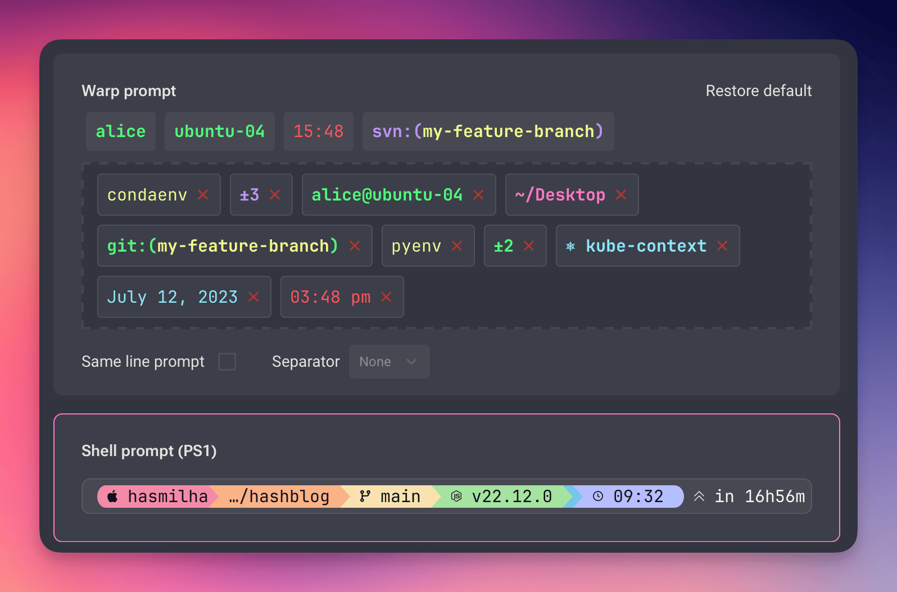
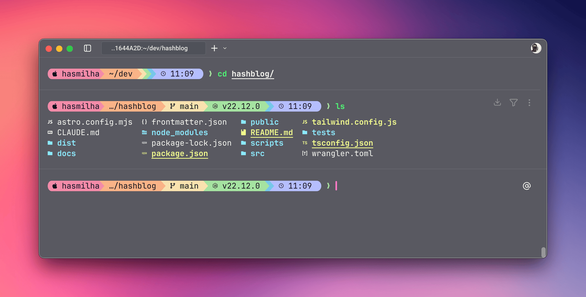

For the longest time, my terminal setup was rock solid. I've written before about how I got my terminal looking pretty with [iTerm2 and Oh My Zsh](https://hashir.blog/2023/01/oh-my-zsh-making-my-mac-terminal-look-pretty/), and for years, the king of prompts, [Powerlevel10k](https://github.com/romkatv/powerlevel10k), was a key part of that. It was a perfect combination — fast, informative, and looked great. If it ain't broke, don't fix it, right?

Well, things change in the world of software. I recently came across a post from the developer of Powerlevel10k stating that the [project is now on life support](https://github.com/romkatv/powerlevel10k/issues/2690). While it still works perfectly fine today, I generally prefer to use tools that are actively maintained and developed. This was the nudge I needed to see what else was out there.

Around the same time, I made the switch to the [Warp](https://www.warp.dev/) terminal. It's an amazing piece of kit, built from the ground up in Rust, and it probably deserves its own blog post later. Warp has its own smart, built-in prompt, but I'm a creature of habit. I like my prompt to look and feel a certain way everywhere.

With Powerlevel10k's future uncertain, my search for a replacement led me to [Starship.rs](https://starship.rs/).


_Warp's smart prompt vs Starship's colourful display._

#### What is Starship?

Starship is a minimal, blazing-fast, and infinitely customizable prompt for any shell. Like Warp, it's written in Rust, which helps explain its incredible speed. It's designed to be universal, working across different shells and operating systems, providing context-aware information without any lag.

I was sold. It was time to make the switch.

#### Installing Starship on macOS

Getting Starship up and running on my Mac was straightforward using Homebrew.

**Step 1: Install Starship**

Open your terminal and run:

```bash
brew install starship
```

**Step 2: Configure Your Shell**

Next, you need to tell your shell (in my case, Zsh) to use Starship as its prompt. Add the following line to the end of your `~/.zshrc` file.

```bash
eval "$(starship init zsh)"
```

After saving the file, restart your terminal or run `source ~/.zshrc`, and you'll be greeted by the default Starship prompt.

#### Theming with Catppuccin Powerline

Out of the box, Starship looks clean, but the real fun is in the customization. I'm a big fan of the [Catppuccin](https://github.com/catppuccin) theme and was thrilled to find that Starship has an official Catppuccin Powerline preset.

Here's how to get that beautiful, themed look.

**Step 1: Create the Configuration File**

Starship looks for a configuration file at `~/.config/starship.toml`. If you don't have this file or the directory, create them with this command:

```bash
mkdir -p ~/.config && touch ~/.config/starship.toml
```

**Step 2: Add the Preset Configuration**

Now, open the `~/.config/starship.toml` file in your favourite editor. Head over to the [official Starship page for the Catppuccin Powerline preset](https://starship.rs/presets/catppuccin-powerline) and copy the entire TOML configuration from there. Paste it into your `starship.toml` file and save it.

Save the file, restart your terminal one last time, and you should see the beautiful new Catppuccin-themed prompt.

#### Final Thoughts



And that's it. The switch from my old, trusted Powerlevel10k setup to Starship was painless, and I love the end result. It's fresh, modern, fast, and most importantly, actively maintained.

If you're still on Powerlevel10k and looking for a change, or just want to spruce up your terminal prompt, I'd highly recommend giving Starship a try.
