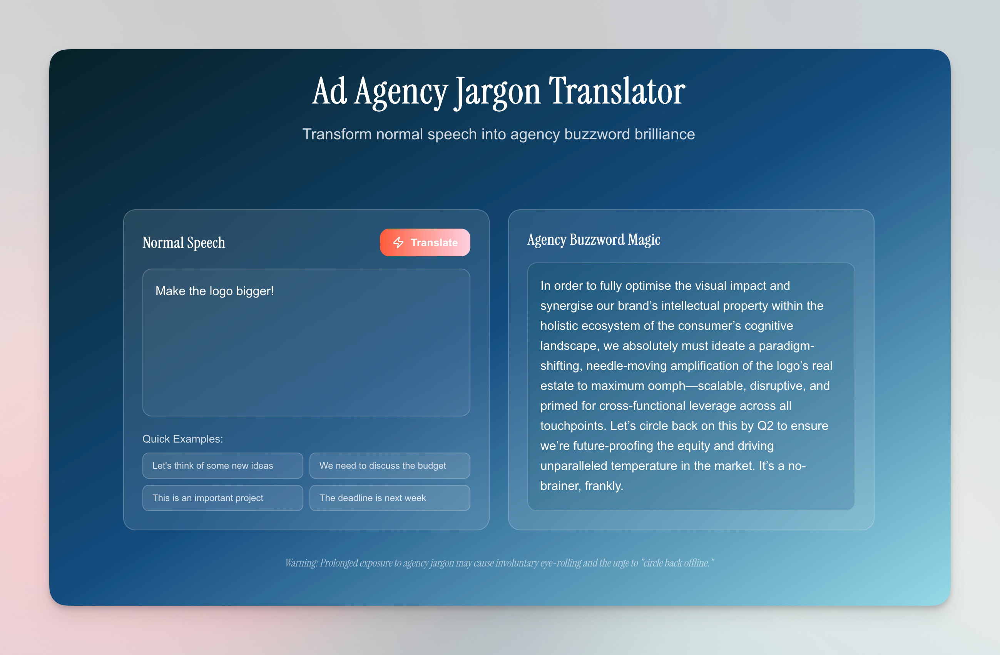

I've spent enough time in the advertising world to know that somewhere between "Let's brainstorm some ideas" and "We need to leverage synergistic solutions for optimal customer engagement," something beautiful and terrible happens. Normal human speech gets transformed into a linguistic soup of buzzwords that would make a corporate consultant weep with joy.

This weekend, I decided to build something to celebrate this phenomenon: an [_Ad Agency Jargon Translator_](https://ad-jargon.pages.dev/) that takes your plain English and transforms it into the kind of agency speak that makes everyone nod knowingly whilst secretly wondering what anyone actually means.

#### So what sparked this ridiculous idea?

The idea came to me during a particularly buzzword-heavy meeting where someone unironically said we needed to "ideate around the value proposition to optimise our customer journey touchpoints." I thought, "What if there was a tool that could help normal humans speak this language?" And more importantly, what if it was completely over the top and hilarious?

So I fired up [Claude Code](https://hashir.blog/2025/06/claude-code-the-vibe-coding-end-game/) and got to work.

#### The stack was dead simple

For a weekend project, I kept things straightforward but modern:

- **Next.js 15** with the App Router for the frontend
- **TypeScript** because even satirical projects deserve type safety
- **TailwindCSS v4** for quick, responsive styling
- **OpenRouter API** with Mistral AI for the translation magic
- **Cloudflare Pages** for deployment

The best part? This entire stack is essentially free to run. Cloudflare Pages has a generous free tier, and OpenRouter's free Mistral model means I can offer this to the world without worrying about costs. The whole thing took maybe a couple of hours max to build and deploy.

#### Claude Code made the design process effortless

One of the highlights of this project was working with Claude Code on the visual design. I asked it to integrate some Google Fonts to give the site a more polished feel, and I also shared some reference images from Pinterest that captured the aesthetic I was going for—clean, modern, with subtle gradients that felt professional but playful.

Claude Code beautifully adapted those visual references into the final design. It's amazing how you can show an AI a mood board and have it translate that into working code with proper typography, spacing, and colour schemes that actually look cohesive.

#### Here's how the magic happens

The concept is simple: you type in normal human speech, and the AI transforms it into agency jargon gold. Behind the scenes, I'm using OpenRouter's API to access Mistral's language model with a carefully crafted prompt that instructs it to be as over-the-top as possible with the corporate speak.

I've also built in some basic rate limiting to prevent bad actors from hammering the API, but for normal use, it's completely free and unlimited.

Some of my favourite transformations so far:

- "Let's think of some new ideas" becomes "Moving forward, we should leverage disruptive ideation to optimise our value proposition"
- "We need to discuss the budget" turns into "At the end of the day, we need to deep-dive into investment allocation for scalable growth potential"
- "The client didn't like it" becomes "The stakeholder feedback indicates we need to pivot our creative execution to better align with their brand vision"

#### The secret sauce was in the prompt engineering

The real fun was crafting the prompt. I wanted the AI to not just add buzzwords, but to really lean into the absurdity of corporate communication. The prompt instructs the model to:

- Use as much jargon as possible without losing meaning
- Include phrases like "moving forward," "at the end of the day," and "circle back"
- Transform simple concepts into complex, multi-syllable alternatives
- Maintain the core message whilst making it sound infinitely more important

#### From code to live site in minutes

One of the things I love about modern web development is how quickly you can go from local development to a live, globally distributed site. I pushed the code to GitHub, connected it to Cloudflare Pages, and within minutes had a URL I could share with the world—all without spending a penny.

The site includes some nice touches like pre-loaded example phrases, a clean gradient design, and even a cheeky disclaimer: "Prolonged exposure to agency jargon may cause involuntary eye-rolling and the urge to 'circle back offline.'"

#### Because the world needs more satirical tools

The [_whole project is open source on GitHub_](https://github.com/hashmil/ad-jargon), because I believe the world needs more tools for creating beautiful, meaningless corporate poetry. Feel free to fork it, improve it, or use it as a starting point for your own satirical projects.

#### Sometimes the best projects make you laugh

Sometimes the best weekend projects are the ones that make you laugh whilst you're building them. This little translator captures something I've experienced in countless meetings and presentations—the way perfectly clear communication gets wrapped in layers of professional-sounding nonsense.

Will it change the world? Probably not. Will it help you sound like a seasoned agency veteran (with a healthy dose of cringe) in your next brainstorming session? Absolutely. And sometimes, that's enough for a weekend well spent.

Try it out at [*ad-jargon.pages.de*v](https://ad-jargon.pages.dev/) and tweet me [@hashir](https://x.com/hashir) with the ridiculous translations you discover. Just remember to circle back offline if you need to ideate around any optimisation opportunities.
