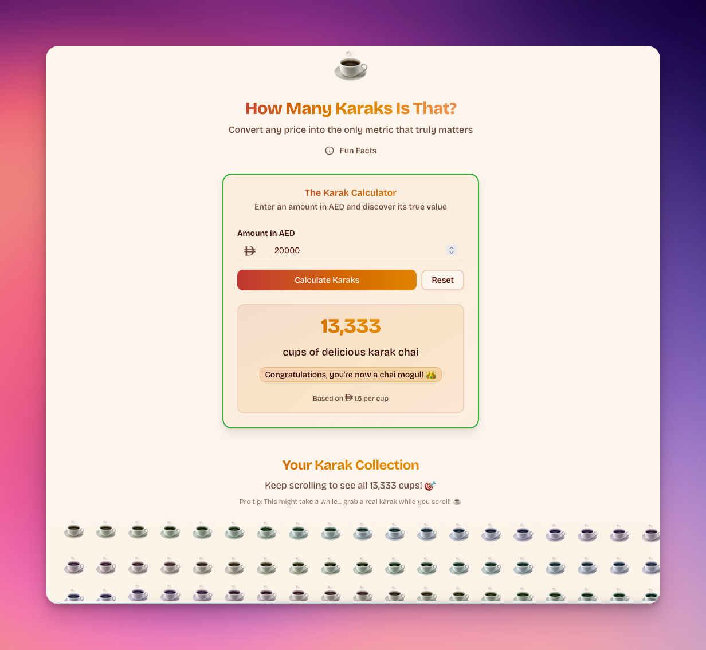

Living in the UAE, you quickly realise there's an unofficial currency that runs parallel to the dirham. It's not crypto, it's not gold—it's karak chai. When someone mentions a price, my brain automatically converts it: "That's 20 dirhams... so about 13 cups of karak." It's the only conversion rate that actually matters.

This weekend, I decided to build something to celebrate this cultural phenomenon: a [_Karak Calculator_](https://karak-calculator.pages.dev/) that takes any AED amount and tells you what it's really worth—in cups of that sweet, spiced tea that keeps this country running.

#### So what sparked this caffeinated idea?

The idea hit me during a conversation about rent prices. Someone mentioned their monthly rent, and instead of thinking about square footage or location, my first thought was "That's roughly 10,000 cups of karak per month." That's when I realised we needed an official tool to make these conversions properly.

Plus, I'd been wanting to experiment with [Next.js 15](https://nextjs.org/) and the new App Router, and what better way to test new tech than with something that celebrates the UAE's unofficial liquid gold?

#### The stack was perfectly simple

For a weekend project celebrating karak culture, I kept the tech stack modern but straightforward:

- **Next.js 15** with the App Router for that bleeding-edge React experience
- **TypeScript** because even fun projects deserve type safety
- **TailwindCSS 4** for rapid styling (with some custom animations)
- **shadcn/ui** components for that polished look
- **Cloudflare Pages** for deployment

The whole thing is free to run and took maybe 3-4 hours to build and deploy. The longest part was getting the emoji animations just right—because if you're going to visualise thousands of karak cups, they better float beautifully across the screen.

#### The maths behind the magic

The core calculation is delightfully simple: I've set the average karak price at 1.5 AED per cup, which is pretty accurate across most cafeterias and tea stalls in the UAE. Enter any amount, and the app tells you exactly how many full cups you can afford.

Some of my favourite conversions so far:

- A coffee at Starbucks (15 AED) = 10 cups of karak
- Monthly gym membership (300 AED) = 200 cups of karak
- Dubai Metro day pass (20 AED) = 13 cups of karak

#### The emoji visualisation was the fun part

Here's where things got interesting. When you calculate a large amount—say, your salary—the app shows you every single cup as a floating emoji. I built a viewport-based virtualisation system because rendering 10,000+ emoji at once tends to crash browsers (learned that the hard way).

The emojis float with subtle animations, each with a slight colour variation and staggered timing. It's oddly mesmerising to scroll through thousands of tiny teacups, especially when you realise that's what your monthly expenses look like in karak terms.

But here's the brilliant bit: if someone enters a ridiculously large number—say, a million dirhams—you get this absolutely massive page filled with over 650,000 floating tea emojis. The app even cheekily suggests: "Pro tip: This might take a while... grab a real karak while you scroll! ☕" It's wonderfully absurd watching someone's theoretical lottery winnings rendered as an endless sea of animated teacups.

#### UAE culture meets modern web development

One detail I'm particularly proud of is using the official new UAE Dirham symbol throughout the app. I created a custom SVG component for it because proper typography matters, even in satirical currency converters.

The app also includes some fun facts in a dialogue: the average person in the UAE drinks 3-4 cups of karak per day, which works out to roughly 1,923 AED worth of karak annually. That's a serious chai investment.

#### From localhost to global deployment in minutes

The beauty of modern web development really shines here. I wrote the code locally, pushed to GitHub, connected to Cloudflare Pages, and within minutes had a live URL that works globally. No server configuration, no deployment scripts, no complexity—just pure focus on the idea.

The site even includes some nice touches like responsive design, smooth animations, and proper loading states. Because if you're going to calculate karak conversions, you might as well do it with style.

#### Because every culture needs its metric

The [_whole project is open source on GitHub_](https://github.com/hashmil/karak), because I believe the world needs more tools that celebrate local culture through technology. It's a small love letter to the UAE's tea culture and the way karak brings people together across all walks of life.

#### Sometimes the best projects make you smile

The best weekend projects are the ones that make you chuckle whilst you're building them. This little calculator captures something real about living in the UAE—the way karak has become such a fundamental part of daily life that it might as well be our unofficial unit of measurement.

Will it revolutionise how we think about money? Probably not. Will it help you realise that your daily latte costs the same as 10 cups of delicious karak chai? Absolutely. And sometimes, that perspective shift is worth a weekend of coding.

Try it out at [_karak-calculator.pages.dev_](https://karak-calculator.pages.dev/) and tweet me [@hashir](https://x.com/hashir) with your most surprising karak conversions.
